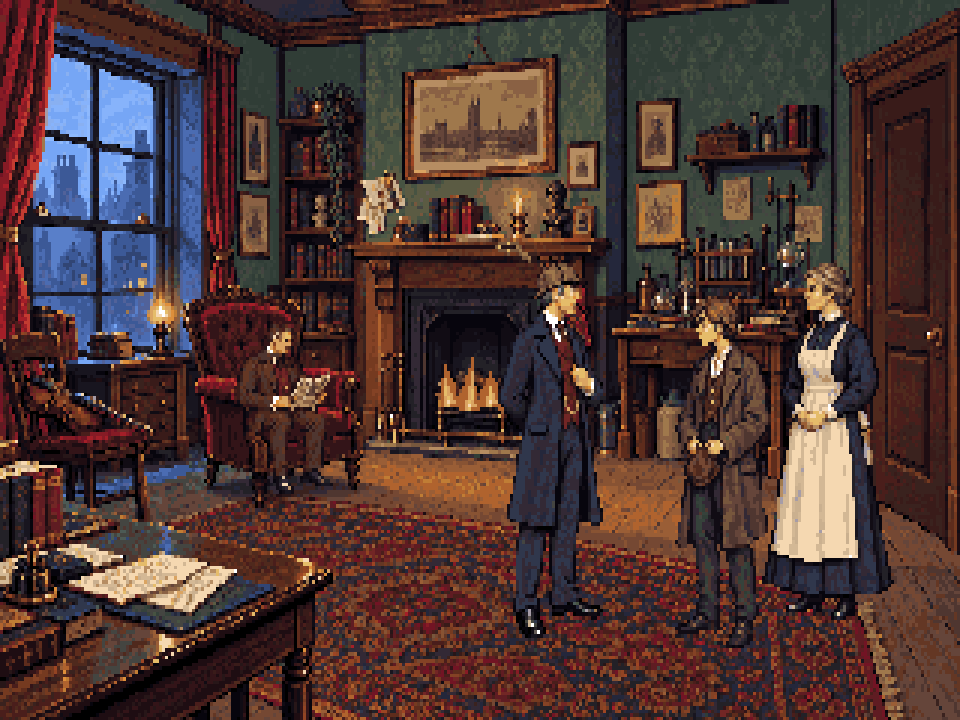
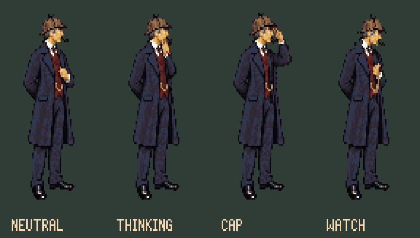
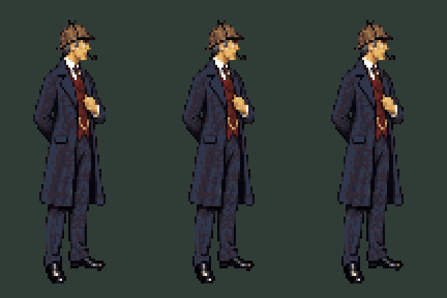
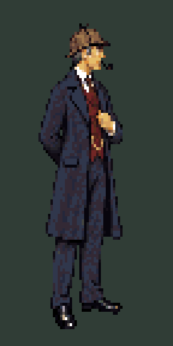
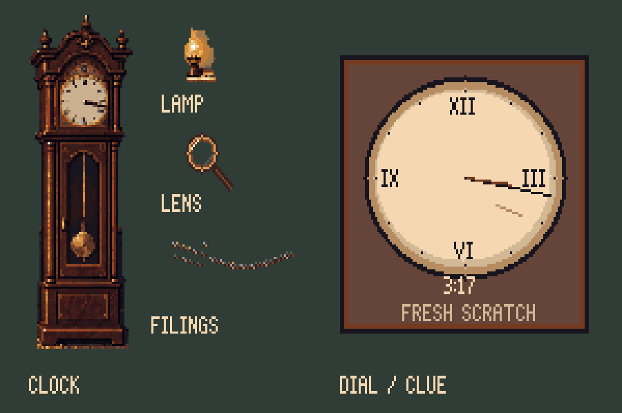
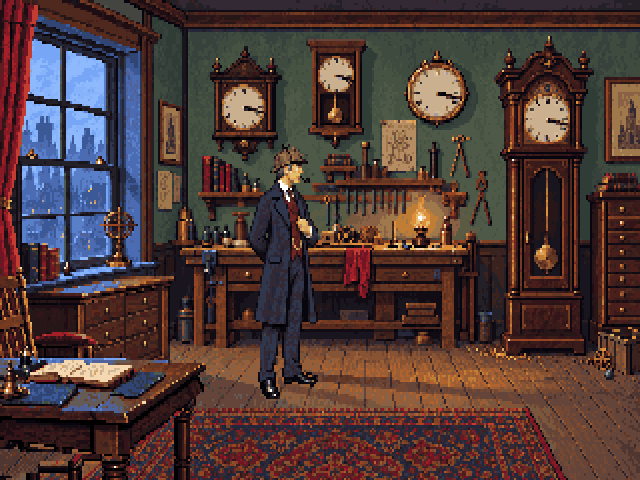
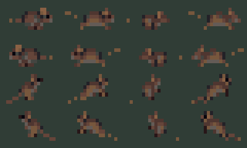
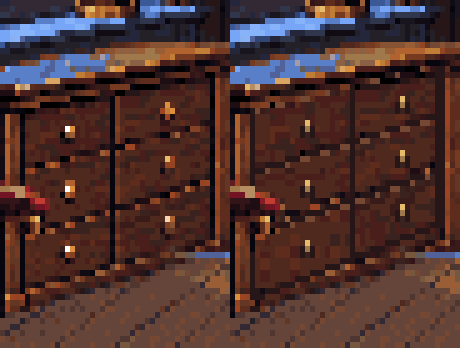
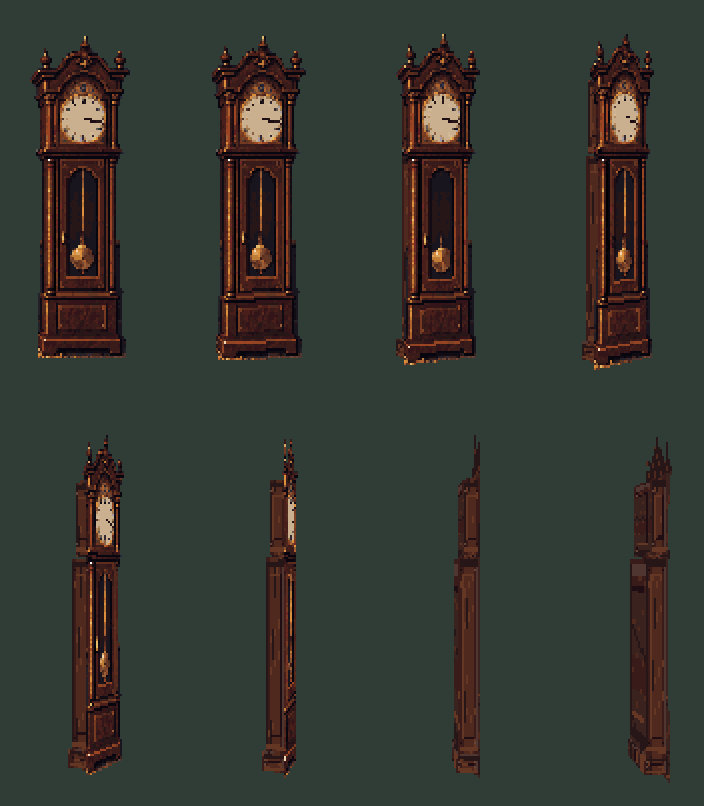
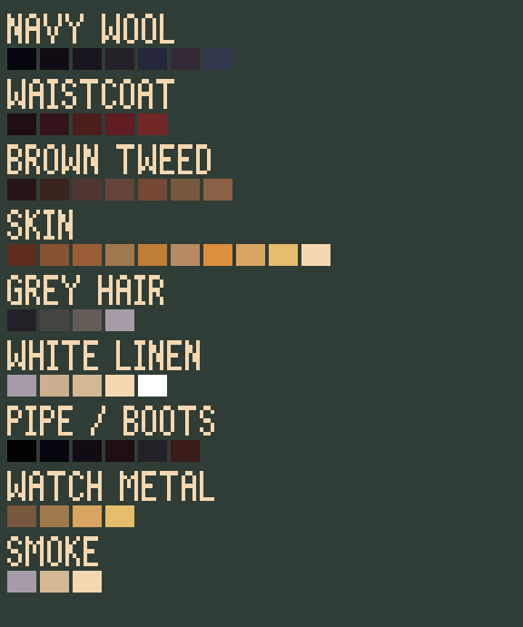

# sci-sherlock: The Stopped Clocks

An original Sherlock Holmes adventure built with [sci-ts](https://github.com/rlueder/sci-ts),
an SCI2 engine in TypeScript. Explore a clockmaker’s workshop, follow a trail of brass
filings, and investigate a clock stopped at **3:17**. This repository contains the
playable [four-room teaser](docs/teaser.md), from 221B to the hidden stair.
The additional rooms and cast currently use stand-in art awaiting the finished assets.

[](art/studies/workshop-r9/README.md)

**Current art study:** the workshop above uses the latest room and character artwork.
The playable prototype still uses an earlier asset pass; the newer studies have their
own previews and await game integration. **320×200 native pixels · 64 shared colours ·
4:3 display · editable Pixelorama and Blender sources.**

This is a **learning project**: the source drawings, generation prompts, construction
guides, rejected experiments and export checks are kept beside the results. Start with
the [art learning guide](docs/art-learning-guide.md) to reproduce the workflow.

## Play locally

Requires **Node 22.18+** and **pnpm**.

```sh
pnpm install
pnpm dev       # http://127.0.0.1:5173/ — use the port printed by Vite
```

The engine comes from npm as `sci2-ts`: code imports `sci2-ts/...`, and its command is
`sci-ts`. `pnpm dev` builds `out/game` and serves the workshop page;
restart it after changing game art or rooms, then reload the browser.

| Control | Action |
|---|---|
| Walk / **1** | Click the floor to move Holmes |
| Look / **2** | Inspect objects; click the scene to advance dialogue |
| Use / **3** | Interact; right-click also cycles verbs, including Talk |
| Restart | Reset the scene and its clue flags |

Begin at 221B, hear Toby’s story, and take the lens from the mantel. Continue through
Baker Street to the workshop, inspect the clocks and filings, and discuss the deductions
with Watson to reveal the route to the hidden stair.

`pnpm play` opens the engine’s player; `pnpm edit` opens its live room editor.

## 221B: a different camera, the same visual language

[](art/studies/baker-street-r13/README.md)

The first 221B study uses an oblique entrance view and the workshop's shared palette
and character scale. It includes fixed cast references, head and joint guides,
Blender camera construction, a hinged door, fire keys and a removable mantel lens.
Open /art/studies/baker-street-r13/ on the local server for the interactive review.
These are new art studies; the playable game still uses its existing stand-ins.

[Sources and reproducible workflow](art/studies/baker-street-r13/README.md)

## Holmes: one model, several gestures



The current master keeps Holmes around sixty, with natural proportions, a deerstalker,
black clay pipe, long overcoat and a permanent waistcoat watch chain. The latest idle
study adds chin contact, a small cap lift and a downward glance at the watch. Unchanged
parts reuse the master’s pixels instead of being generated again for every frame.

[Character master and editable layers](art/reference/holmes-master-v2/README.md) ·
[Idle animation sources and review](art/studies/holmes-r10/README.md) ·
[1895 costume and pipe brief](docs/holmes-costume.md)

**Review status:** the pipe puff is approved; the other idle gestures remain under
review. Walking is deferred until those gestures are settled. On the local server,
open `/art/studies/holmes-r10/` to play, pause, step frames and overlay joint guides.

### Idle animations



**Thinking · cap adjustment · pocket watch.** These loops use the current fixed
character master and return to the neutral pose. The frame-by-frame review remains
available at `/art/studies/holmes-r10/` on the local server.

<details>
<summary><strong>Approved pipe puff</strong></summary>



The smoke animates on its own layer; the character and waistcoat chain remain fixed.
[Editable master and smoke timeline](art/reference/holmes-master-v2/README.md).

</details>

### Investigation actions

[Reach and kneel review](art/studies/holmes-r11/README.md) adds whole-body keys, joint
overlays and native Pixelorama sources for the two required investigation gestures.
Preview at /art/studies/holmes-r11/. These remain art studies; see the
[delivery queue](docs/art-delivery-status.md) for what is ready and what remains.

## Interactive props and clues



Room props are separate assets: the lamp’s light can flicker without moving its
housing, the pendulum can move inside a fixed case, and the lens, filings and dial
inspection support the investigation. The gallery combines the current r9 clock/lamp
with the r5 clue assets; it shows the art sources, not a screenshot of their runtime integration.

[Room layers, motion and sources](art/studies/workshop-r9/README.md) ·
[Interactive clue study](art/studies/workshop-r5/README.md) ·
[Asset specifications](docs/visual-spec.md)

## A workshop with quiet motion



**Room ambience loop:** rain, lamplight and pendulum movement. The interactive review
also includes the slower weather-color cycle and occasional mouse visits.



Rain stays within the window glass, the blue sky palette cycles through changing
weather, and a mouse occasionally crosses between pieces of furniture. Its direction
and occlusion are reviewed against the actual floor path. The grandfather-clock
pendulum is a switchable art study; its use in gameplay still needs to respect the
story’s stopped-clock clue.

[Watch the enlarged clock-to-bench mouse route](art/studies/workshop-r9/review/clock-route-closeup.gif) ·
[Weather cycle preview](art/studies/workshop-r9/review/weather-cycle.gif)

Open `/art/studies/workshop-r9/` on the local server to toggle effects, choose mouse
routes, scrub their motion and inspect the furniture masks.

## Learn from the construction



**Cabinet perspective, before → after.** The drawer rows share a vanishing point;
the original wood texture is reprojected onto that plane. The correction is isolated
in an editable layer. [See the construction drawing](art/studies/workshop-r9/cabinet-perspective.svg)
and [rebuild the study](art/studies/workshop-r9/README.md).

<details>
<summary><strong>Clock turn: eight poses from a fixed hinge</strong></summary>



The clock study uses a Blender camera and rigid cabinet volumes to establish depth,
then exports to native pixels. It replaces the earlier flat-image squeeze experiment.
The [latest finish](art/studies/clock-r12/README.md) adds native walnut side/back
panels, joinery, a dark descending threshold and 3:17 handsets. Visual review and
integration remain pending. [Editable Blender source](art/studies/clock-perspective-r4/README.md).

</details>

<details>
<summary><strong>Character palette and material ramps</strong></summary>



Pinned colours help keep the character consistent across redraws. These material
references remain in the v1 pack; v2 adds the permanent watch chain.
[Reference workflow and drift diagnostics](art/reference/holmes-master-v1/README.md).

</details>

Pixelorama handles native cels and layered timelines; Blender provides perspective
and motion guides. The project’s TypeScript tools reproduce conversion and export
checks. Optional OpenAI ImageGen drafting is proprietary; saved inputs let subsequent
editing, conversion and verification run with open-source tools without that service.

## Explore the project

| Start here | What you’ll find |
|---|---|
| [Art learning guide](docs/art-learning-guide.md) | Tool setup, exercises and lessons from unsuccessful passes |
| [Animation and perspective workflow](docs/animation-workflow.md) | Coherent poses, joint guides, hinges and room construction |
| [Teaser plan](docs/teaser.md) | Story, four-room scope and production gates |
| [Visual specification](docs/visual-spec.md) | Asset sizes, anchors, states and handoff requirements |
| [Art workflow](docs/art-workflow.md) | Palette, transparency, manifests and native export |
| [Art research](docs/art-research.md) | Reference games and tool decisions |
| [Art archive](art/README.md) | Earlier revisions, decisions and editable sources |

The [v6 composition](art/approved/workshop-v6/README.md) remains the approved style
and scale target. Earlier deliveries are retained for learning, including the rejected
r2 adaptation still used by the playable prototype. Technical validation does not
constitute art approval. Other rooms, cast portraits, audio and a save/load interface
are still pending.

## Edit and validate

Open the `.pxo` masters beside each study in **Pixelorama 1.2.3**. Each study README
identifies its source files, build commands and native-export checks. The current
runtime asset set has seven masters and 39 unique PNGs under `art/source/`; newer
studies have separate manifests and must be integrated deliberately.

```sh
pnpm art check art/art.json
pnpm art build art/art.json          # also writes an importable palette.gpl
pnpm export-art --check              # requires Pixelorama; compare native exports
pnpm export-art                     # export and update runtime PNGs
pnpm preview                        # headless playthrough and screenshots
pnpm check                          # types, art validation and tests
```

Set `PIXELORAMA_BIN` to the editor executable, or put `pixelorama` on PATH. Native
editor installation is optional for playing and CI. Preserve manual edits before
running a study builder: builders regenerate their editable projects.

The headless playthrough checks walking, lamp animation, clue gating, dial inspection,
clock reveal, returned control, revisit persistence and missing kernels. It saves
screenshots under ignored `out/art/sherlock-preview/`.

**Asset path:** editable art → PNGs → `art/art.json` → `resources.ts` → SCI resources.
Placement and walk polygons live in `rooms/102.room.yaml`; dialogue, clue flags and
reveal choreography live in `rooms/102.yarn`.

The README galleries are lightweight exports of existing cels, with nearest sampling
and the correct display pixel aspect. Rebuild them with
`pnpm exec tsx art/source/readme-gallery.ts`; [image provenance](docs/images/README.md)
records the inputs. Add `--gifs` to rebuild the compact animated previews with
FFmpeg; the script verifies decoded frames against the original study GIFs.
Compiled archives and temporary screenshots stay in ignored `out/`.

To develop against a local engine checkout, run `pnpm package` there and then
`pnpm link ../sci-ts/out/package` here.

## License

[MIT](LICENSE) covers this project’s code, art and writing. sci-ts has its own license.
[Asset credits](art/credits.csv) and each study’s saved sources document provenance;
no reference-game artwork is included.
