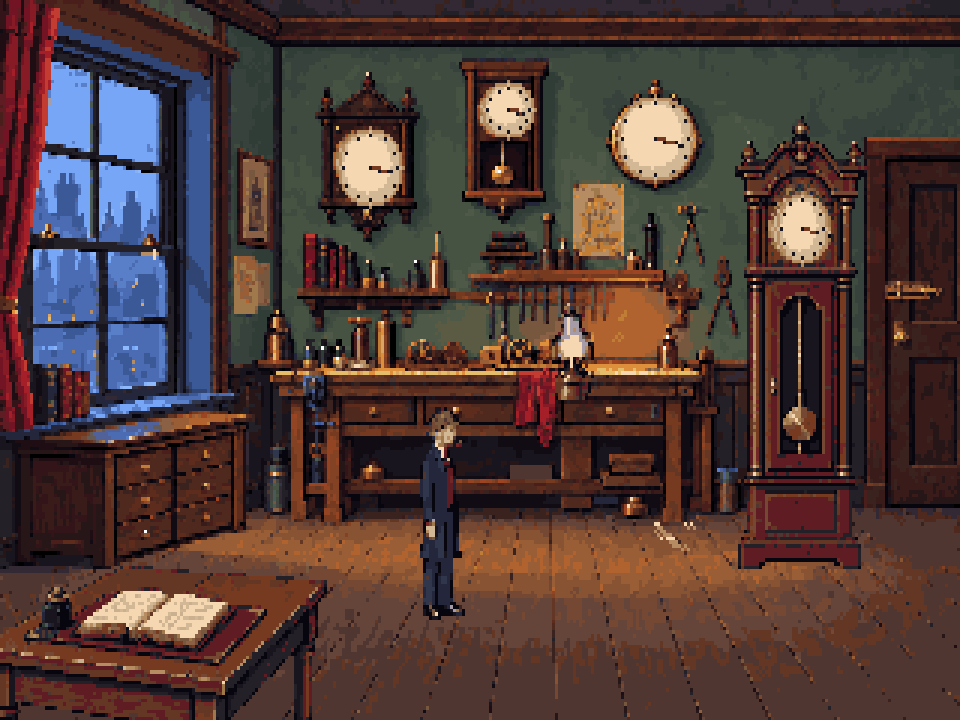
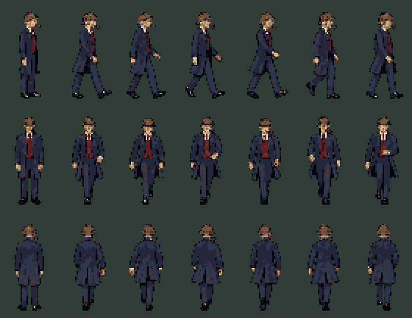

# Workshop revision 2: Holmes and layered room

**REJECTED VISUAL PASS.** The user selected the exact
[v6 composition](../../approved/workshop-v6/README.md) as the locked target.
The assets below remain experimental technical work, not approved production art.
Their character scale, replacement furniture and simplified rendering must not be
propagated to later rooms or cast. Technical validation does not imply visual approval.

First delivery against `docs/visual-spec.md`. Restrained illustrated adventure art,
natural proportions, muted olive/walnut/burgundy/slate/amber. Holmes is **58–62**,
upright and wiry, with grey temples and nape, an angular lined face, deerstalker and
pipe. The young sheet is retained as provenance; production uses the aged sheet.

## Review

Run `pnpm dev`, then open <http://127.0.0.1:5173/art/production/workshop-r2/> for actual
exported pixels, animations, native dimensions, 4:3 display and greyscale. This is art
staging, not room logic or collision. PNG reviews are also saved in this directory.





## Delivered assets

| Resource | Master | Canvas/cels | Registration |
|---|---|---|---|
| Picture 102 | workshop.pxo | Two 320×200 layers | Base -1000; near table provisional foreground 181 |
| View 200 | holmes.pxo | 21 PNGs, 32×64; figure up to 60 px, 14 colours | Feet [16,62]; E/W/S/N; west mirrored; stand + six walk |
| View 220 | lantern.pxo | Four 19×30 cels | [9,29] |
| View 221 | clock.pxo | Eight 76×132 cels | [22,131]; fixed right hinge at local x=43 |
| View 227 | filings.pxo | Patch/trail, 32×16 | [16,15] |
| View 228 | scratches.pxo | One 16×12 cel | [8,11] |
| View 240 | dial-inspection.pxo | One 120×112 cel | [0,0] |

One shared 64-colour palette, binary alpha, 39 unique PNGs. The manifest lists 40
images because old view 224 temporarily aliases view 240. Including the palette,
nine SCI resources are compiled. `report.json` records source bounds and clock angles.

## Engine handoff

YAML and Yarn are unchanged. Trace the new composition's floor, obstacles and hotspots
again. The existing playable scene is a compatibility smoke test, not placement sign-off.

Art staging anchors: Holmes [147,171], lantern [190,111], clock [267,157], filings
[225,154], scratches [259,156]. Wall-clock centres: [123,46], [169,30], [218,38].
Near table: approximately x=0–109, y=157–199. Dark opening: x=250–283, y=44–142.
These guide coordinates are not gameplay hitboxes; trace the actual image edges.

- Switch inspection 224 to 240, then remove the compatibility alias.
- Add filings 227 (0 patch, 1 trail) and optional scratches 228 to the reveal.
- Tune actor scaling and foreground depth to the new furniture proportions.
- Review walking at gameplay speed: this is the first illustrated pass; limb rhythm
  and foot contact remain visual-review items, not certified by PNG validation.
- Review the clock's apparent thickness: this pass uses a simplified planar hinge turn.
- Watson and the other rooms, cast and interface are subsequent deliveries.

## Reproduce and edit

The background, props and Holmes sources were drafted with built-in OpenAI ImageGen.
`prompts.json` contains original prompts; `holmes-age-prompt.txt` records the age edit.
That generation service is proprietary and optional. Ongoing editing and builds use
open-source TypeScript conversion, Pixelorama 1.2.3 and sci-ts; no AI service is needed.

```sh
# Reconstruct in ignored staging, preserving edited masters.
node --import tsx art/source/production-r2.ts
# Publication of this rejected pass is disabled; --publish now fails explicitly.
# Normal workflow after editing a .pxo master:
pnpm export-art
pnpm art check art/art.json
pnpm preview
```

Conversion uses nearest-neighbour sampling, alpha threshold 220, one fixed palette,
native-pixel clock hands and clues, registered sprite canvases, and disconnected
gutter-fleck cleanup. Following the user's classic point-and-click correction, Holmes
uses 14 colours from the shared palette and simplified cloth shading. Prop bases use
a 24-colour subset with native flame/dial details added afterward. One conservative
neighbour pass removes low-contrast background flecks while preserving edges and
the approved room palette. The review page includes the earlier approved comp for comparison.
No adaptive palette or dithering. Raw images are provenance,
not runtime textures. Credits and project licensing are in `art/credits.csv`.
