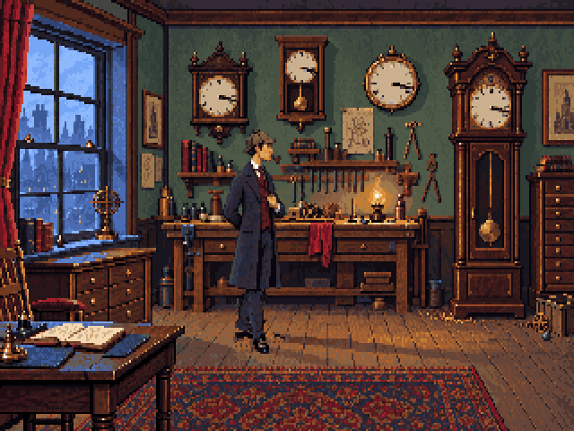
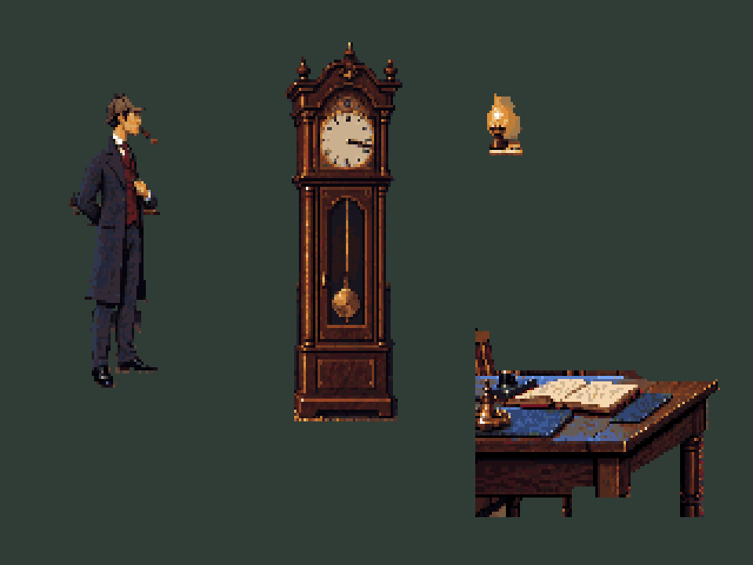

# V6 artwork in motion

**Motion review:** the user identified substantial walk-cycle work and incorrect clock
perspective. This pass establishes reference fidelity, not approved animation. See the
[replacement animation workflow](../../../docs/animation-workflow.md).

Open <http://127.0.0.1:5173/art/production/workshop-r3/> with `pnpm dev` running.
The page starts the actual side-on walk, beside the unchanged reference. Controls
show standing, each cel, east/west, native pixels, greyscale and the clock opening.





## What changed

This pass extracts Holmes, the tall-case clock, the workbench lantern and the near
table directly from `art/approved/workshop-v6/workshop-320x200.png`. Their visible
colours and pixels come from that exact image. Holmes retains the reference's roughly
105-pixel figure height on a 72×116 canvas, anchor [36,113], reference position [144,165].
The rejected r2 character, furniture and colour simplification are not used.

The east walk has six articulated cels plus the exact standing cutout. West mirrors
east. The head, torso, lapel hand and coat reuse the original pixels, with a one-pixel
rise on passing poses. Legs rotate around hip/knee/ankle joints with nearest sampling;
hidden upper trousers extend beneath the coat to keep the joins connected. This is
a first cutout-animation pass, not a final hand-polished cycle. North/south and the
requested local age edit remain to be drawn.

The clock has eight cels about its right hinge. The lantern has four flame cels.
The near table is its own full-canvas foreground. The lantern's original glow is
included in its cutout; the reconstruction does not introduce the rejected white lamp.

Only hidden surfaces use a new ImageGen source, `hidden-surfaces-source.png`; the
exact built-in-tool prompt is saved beside it. The source is cropped through explicit
extraction masks. Approved pixels outside those masks are unchanged. `masks.json`
records the coarse outlines; `reference-r3.ts` also performs indexed-colour edge cleanup.

## Files and validation

- `source/reference-separated.pxo`: full composition as five editable layers.
- `source/workshop.pxo`: clean base and foreground, 320×200 each.
- `source/holmes.pxo`: standing plus six east walking cels.
- `source/clock.pxo`, `source/lantern.pxo`: the original props and animation cels.
- `export/`: actual native PNGs and room review frames; no high-resolution runtime art.
- `art.json`: separate review manifest, picture 102; views 200, 220, 221.
- `report.json`: preservation and validation results.

Rebuilding the standing composition from the extracted layers is asserted pixel for
pixel against v6: **zero changed pixels**. The clean background has **zero changed
pixels outside extraction masks**. The manifest validates 21 listed images, binary
alpha and the unchanged shared 64-colour palette. The GIF encoder uses that same palette
and nearest-neighbour 4:3 display correction, without new colours or smoothing.

Native Pixelorama 1.2.3 export was also checked: five masters, 22 compared exports,
all decoded pixels identical. Results are recorded in `native-export-check.json`.

```sh
node --import tsx art/source/reference-r3.ts
pnpm art check art/production/workshop-r3/art.json
```

The reconstruction script regenerates this review delivery, including its masters;
do not run it over hand-edited masters without retaining those edits. Normal further
artwork can be edited in Pixelorama 1.2.3. This delivery is separate from the main game
manifest and YAML/Yarn because the engine session owns integration, placement and depth.
No visual approval is implied by technical validation.
