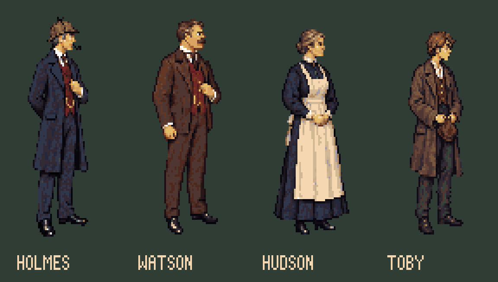
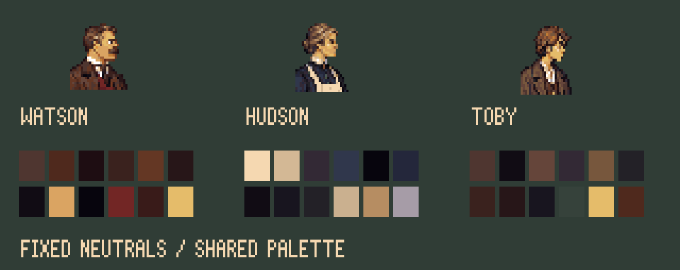

# 221B Baker Street — room and cast reference pass

Open [the interactive preview](http://127.0.0.1:5176/art/studies/baker-street-r13/) while serving this repository. This study is not installed in the game.

## What is ready to review

- Native 320×200 room, separate foreground occlusion, empty Watson chair.
- Watson, Mrs Hudson and Toby neutral models; one complete seated reading pose for Watson.
- Six rigid door poses from a local Blender hinge, four flame keys behind the grate, removable mantel lens.
- Fixed head crops, model hashes, dominant colour indices, joint annotations, room blockout, camera measurements and placement regions.

These are first references, not approved models or full production view contracts. Page turning, portraits, directional poses and walks are still pending. Standing Watson is 104px tall, Hudson and Toby 99px, against the unchanged 106px Holmes master. All use 72×120 with anchor [36,113]. The seated drawing is 47px high on that same canvas, projected at the painted chair depth; the previous arbitrary 83px fit is superseded. See [canon and scale notes](canon-and-scale.md).

## Camera variation with a common style

221B uses an oblique entrance composition; the workshop keeps its frontal composition. The intended Blender camera is yawed 26°, focal length 45mm, horizon y=72. Its two horizontal vanishing points are approximately [-39,72] and [976,72]. Guides are native coordinates; display y is stretched by 1.2.

The generated room interprets the construction drawing rather than exactly projecting it. Compare the painting with the blockout using the preview checkbox or [overlay](guides/painted-perspective.svg). Furniture edges and architectural convergence still need review. Do not use this intended camera as a solved projection of every painted surface.

The door has a separate local fit to its painted quad, with a fixed hinge and perspective-correct texture sampling. Do not mix this local coordinate system with the whole-room blockout. Closing the door reconstructs the original room pixels exactly. Its reverse currently reuses the panel joinery with a darker palette mapping.

Across rooms preserve the workshop 64-colour palette, 320×200 native resolution, 1.2 display aspect, pixel cluster density and character size. Camera variation must not become inconsistent anatomy or a reason to resize characters between cels.

## Fixed character workflow

1. Review a complete neutral figure against Holmes and the room.
2. Pin the neutral PNG, head crop, palette indices and SHA-256 in [models.json](models.json).
3. Draw each new action as a complete coherent pose. Reference the pinned model; do not append replacement limbs to a static body.
4. Name head variants explicitly, such as Watson looking down at the newspaper. Do not silently regenerate identity.
5. Trace head, neck, shoulders, elbows, hands, pelvis, knees and ankles. Hidden joints are estimates, not a solved skeleton.
6. Animate only after comparing silhouettes, head size, coat volume and material colours. Keep a single canvas and baseline; never fit each animation frame independently.

The preview mirrors Hudson and Toby so they face Holmes. These are staging mirrors, not finished left-facing models or four-direction walk loops. Review costume asymmetries before production.

The superseded initial [seated plan](guides/watson-seated-plan.png) is retained as an unsuccessful staging study alongside the [trace of the completed drawing](guides/watson-seated-trace.png). Their differences are visible evidence of the drawing process. Watson's seated proportions and chair contact still need visual review.

## Layers and handoff

| Resource | Study content | Native contract |
|---|---|---|
| Picture 100 | Background + foreground occlusion | 320×200 |
| Views 201–203 | Watson, Hudson, Toby neutral | 72×120, [36,113], one cel each |
| View 205 | Watson reading | 72×120, [36,113], neutral only |
| View 222 | Hearth/fire | 40×42, [20,40], four keys |
| View 223 | Mantel lens | 12×8, [4,3], removable |
| View 225 | Door | 100×160, [70,145], six keys |

The foreground is an occlusion duplicate of static furniture, not a reconstruction of floor hidden behind it. The fire patch is opaque and includes the stationary hearth. The lens is absent from the background. The background contains an exposed dark landing; door cel zero restores its closed appearance.

[scene.json](scene.json) has proposed room placements and target rectangles. Existing YAML, Yarn and runtime art were not changed. Confirm floor, depths, actor entry points and hotspot alignment with the engine session. Do not merge this manifest into production yet: the cast lacks required directional loops and view 205 lacks its page-turn loop.

## Sources and reproducible tools

Original generated PNGs and exact prompts are under [generated/](generated/). The room references the approved workshop and the room construction plan; new characters reference the fixed Holmes master; seated Watson references his new neutral, the empty room and a seated joint plan.

The initial raster drawings were made with OpenAI image generation. That generation step is neither open-source nor deterministic. The editable workflow after generation is open source: Blender 4.5.14 for camera/hinge construction, Pixelorama 1.2.3 for native layered/cel masters, and the repository's TypeScript pixel tools for conversion and export. Future hand-painted sources can enter the same pipeline.

From the repository root, with Blender available as $BLENDER_BIN:

~~~sh
"$BLENDER_BIN" --background --python art/studies/baker-street-r13/build-guides.py
pnpm exec tsx art/studies/baker-street-r13/plan.ts
pnpm exec tsx art/studies/baker-street-r13/convert.ts
pnpm exec tsx art/studies/baker-street-r13/cast-guides.ts
"$BLENDER_BIN" --background --python art/studies/baker-street-r13/fit-chair.py
pnpm exec tsx art/studies/baker-street-r13/chair-guide.ts
"$BLENDER_BIN" --background --python art/studies/baker-street-r13/build-door.py
pnpm exec tsx art/studies/baker-street-r13/build.ts
pnpm exec tsx art/studies/baker-street-r13/reference-guides.ts
pnpm exec tsx art/studies/baker-street-r13/compress-gifs.ts
pnpm art check art/studies/baker-street-r13/art.json
pnpm exec tsx art/studies/baker-street-r13/verify-native.ts
~~~

Set PIXELORAMA_BIN to the Pixelorama executable for the last command. The verifier opens all twelve native projects and compares decoded exports to their PNG counterparts, including exclusion of hidden guide layers. Type checking also covers these study scripts.

Conversion uses nearest sampling and the pinned 64-colour palette, with binary alpha and no dithering. Source-to-native scale is recorded in model data. The 1.2 horizontal precompensation on character conversion restores correct proportions after the engine's vertical display stretch.

Native .pxo and .blend files are in [source/](source/). The scripts reproduce them from checked-in drawings and measurements; image generation does not need to be repeated. Rebuilding Blender sources may create local .blend1 backups; they are not delivery assets.
