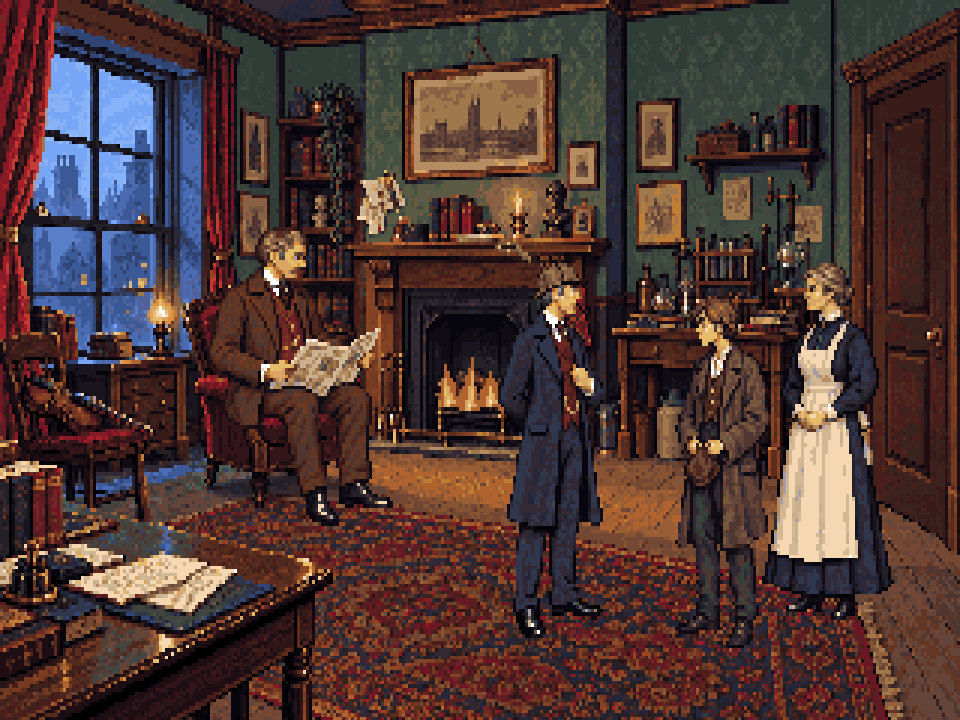

# Doyle references and chair-scale correction

## Watson: textual constraints

In [The Adventure of Charles Augustus Milverton](https://www.gutenberg.org/files/108/108-h/108-h.htm),
Lestrade describes the masked second intruder as medium-sized, strongly built, with
a square jaw, thick neck and moustache; Holmes immediately points out the resemblance
to Watson. These are the physical constraints used for the revised neutral and seated
models. The design presents a capable former army doctor, not a comic oversized figure.

Middle age around 45, brown hair, the brown lounge suit and oxblood waistcoat are
this game's choices for its 1895 setting, not precise facts supplied by that passage.
Holmes's requested age of 58–62 remains an explicit adaptation choice and does not
force Watson to be the same age. The earlier prompt's late-fifties assumption for
Watson is superseded. The dark moustache, squarer jaw and sturdier neck are retained
in the new seated redraw. Do not borrow a film actor's likeness.

## Mrs Hudson: distinguish description from invention

[The Adventure of the Dying Detective](https://www.gutenberg.org/files/2350/2350-h/2350-h.htm)
identifies Hudson as Holmes's landlady and describes her patience, concern for him
and response to his apparent illness. That passage does not prescribe a detailed
face, exact age, hair colour, body dimensions or uniform.

Her grey bun, mature appearance, dark high-necked dress and practical apron are
period-inspired design choices, not claimed quotations from Doyle. Keep her bearing
as a capable landlady who manages the household. The current model is retained:
there is no textual basis here for forcing a different physical stereotype or
redrawing her solely to imitate an adaptation.

## The seated-size error and its correction

The previous seated sprite was fitted to an arbitrary 83px height and placed without
using the chair's depth. The first room blockout also located its proposed chair
farther forward than the chair in the resulting painting. Using that old proposal
would perpetuate the mistake.

fit-chair.py loads the existing room camera and fits a local body to the **painted**
chair floor at [94,133]. The camera horizon is y=72, eye height 1.8m and native pixel
aspect 1.2. Assumptions: Watson standing stature 1.75m, seat about 0.50m, seated crown
1.28m above the floor. These are construction choices, not canonical measurements.

Blender projects the 3D joint positions and toe point to determine the seated
envelope: crown y≈89.6, toe y≈137.1, export height 47px. At the chair's depth, his
standing height would be about 59px; the front-of-room model remains 104px. Depth
scaling is not a change to the character's proportions. No walk frames are individually
fitted. The seated pose is redrawn completely, then sampled to this fixed room placement.

Files:
- source/watson-chair-fit.blend — room camera and physical skeleton.
- guides/chair-fit.json — projected/world joints, physical assumptions and export height.
- guides/chair-fit.png — joint construction over the painted room.
- guides/seated-joints.json — separate trace of the completed pixel drawing.
- generated/watson-canon-prompt.txt and watson-seated-camera-prompt.txt — exact redraw prompts.
- generated/*-before-*.png and review/room-cast-before-camera.png — preserved earlier work.

The guide is a local fit; it does not establish that all painted architecture is
camera-calibrated. The drawing is not a rigid rig and its joint trace can depart
from the projection. Review seat contact and the small distant face in the complete
room before proceeding to page-turn keys.

