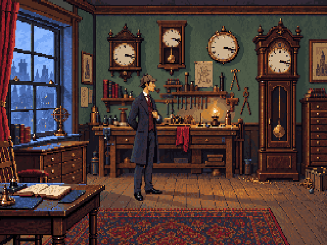

# Clock perspective study: a rigid turn

**1 October 2026.** Technical construction completed; visual approval and game
integration pending. This replaces the geometry method used in r3, not the game's
current resources. The new side surfaces are deliberately documented as rough guides.

Run `pnpm dev` from the repository root and open
`http://localhost:5173/art/studies/clock-perspective-r4/` (use the port Vite prints).
Pause, scrub the eight poses, and toggle Construction. The gold line at native x292
is the fixed hinge; the blue polygons show the cabinet volumes. The dashed horizontal
line is a **candidate local eye level**, not a measured whole-room calibration.

This preview is also plain static HTML and needs no engine build. If the development
server is unavailable, run `python3 -m http.server 5176 --bind 127.0.0.1` from the
repository root, then open `http://127.0.0.1:5176/art/studies/clock-perspective-r4/`.



## What changed and why

R3 compressed image columns by `cos(angle)` and kept every row at its old height.
That is a flat image narrowing, without the depth-dependent projection of a real turn.
This study uses a perspective camera, three inset cabinet volumes and a parent hinge
whose rotation is the only animated transform. The front retains the original clock
pixels. Farther and nearer corners project differently; the hinge itself stays put.
After the front turns away from the camera, its reverse is wood rather than a mirrored dial.

The eight angles are 0, 10, 22, 36, 50, 64, 76 and 84 degrees. The wide plinth and
ornamental front cover narrower volumes behind them. These volumes establish the
turn and occlusion; they are not a finished model of carved clock joinery.

The room composite preserves Holmes, his scale, the table and the rest of v6 exactly.
Only the clock's original opaque footprint receives the hidden-surface/passage study;
the moving clock can naturally cover adjacent pixels. The closed cel is the exact r3
extraction and reconstructs v6 with **zero changed pixels**. The raw Blender guide
differs by four pixels in the closed pose; the exporter records this and explicitly
uses the original closed cel, rather than claiming a perfect geometric silhouette fit.

## Tools and sources

| Part | Tool / source | Role |
|---|---|---|
| Camera, volumes, animation | **Blender 4.5.14 LTS**, GPL | Editable construction with packed reference images |
| Pixel master and native export | **Pixelorama 1.2.3**, MIT | Eight native cels; independently checked through the application's exporter |
| Pixel projection and checks | Project TypeScript tools, MIT | Perspective-correct nearest sampling, palette preservation and repeatable exports |
| Clock front and room | [Approved v6](../../approved/workshop-v6/README.md), via [r3 extraction](../../production/workshop-r3/README.md) | Original pixels, not a new generated interpretation |
| Concealed wall/floor | Existing r3 hidden-surface source | Only behind the original clock mask; its saved provenance includes ImageGen |
| Dark stair opening and wood guides | `export-pixels.ts` | New indexed-pixel construction, no new AI generation |

Blender was obtained from its [official 4.5 archive](https://download.blender.org/release/Blender4.5/).
The macOS arm64 DMG matched the official SHA-256:
`65134d9b07b20e2fa8d3c9e44f6f44ffb5c9774dd521b95f50387310241ca170`.
The application was run from a read-only temporary mount, not installed into this repo.
No fSpy camera solve or Krita assistant file is claimed by this study.

## Reproduce it

Install the repository dependencies with `pnpm install`. From the repository root,
with Blender and Pixelorama available on your PATH:

```sh
blender --background --python art/studies/clock-perspective-r4/build-guide.py
pnpm exec tsx art/studies/clock-perspective-r4/export-pixels.ts
pnpm art check art/studies/clock-perspective-r4/art.json
pnpm exec tsx art/studies/clock-perspective-r4/verify-native.ts
```

On macOS, the first executable is typically
`/Applications/Blender.app/Contents/MacOS/Blender`. Set `PIXELORAMA_BIN` to the full
Pixelorama executable path if it is not named `pixelorama` on your PATH.

`build-guide.py` creates/overwrites `clock-guide.blend` and `projection.json`.
Blender may also leave a local `.blend1` backup; the study ignores that generated backup.
`export-pixels.ts` creates/overwrites this study's PNGs, GIF, manifest, palette,
report, construction SVG and `clock.pxo`. **Copy a master before hand-painting it;
rerunning the exporter replaces it.** The native verifier exports into a temporary
directory, compares decoded pixels and writes `native-export-check.json`.
It does not overwrite the master or PNGs. None of these scripts publishes into
`art/export`, changes room YAML/Yarn, or invokes the main `pnpm export-art` mapping.

Open `clock-guide.blend` in Blender and use camera view (Numpad 0). All source images
are packed. Select `HINGE — fixed at native x292` and scrub frames 1–8. Rotate the
hinge to change the opening; do not animate object scale to imitate a turn. For a
reproducible change, edit the angles or volumes in `build-guide.py` and regenerate.
The JSON projection is an intermediate export, so changing only the `.blend` file
does not change the PNGs automatically.

Open `clock.pxo` in Pixelorama for the actual pixel cels. It has one eight-cel layer
and an `open` tag. Use onion skins to refine the new side faces, crown silhouette
and plinth, while preserving the reference front and the hinge alignment.

## Camera and export contract

- Native room: 320×200; pixel aspect 1:1.2; review display: 4:3.
- Local principal point: [156,72]; focal length: 400 native horizontal pixels.
- Camera distance: 10 world units; closed plane: z=0; one unit is 40 native x-pixels.
- The camera is level, with lens shift. Its parameters are an artistic local fit.
- Cel canvas: **88×168**, room origin **[232,0]**, anchor **[60,150]**.
- The resulting actor position is **[292,150]**. This differs from older manifests:
  do not substitute these PNGs under the old anchor without adapting integration.
- Eight cels, fixed canvas and anchor, binary alpha, unchanged shared 64-colour palette.

The larger transparent cel contains the turn. It does **not** enlarge the character
or rescale the closed clock. PNG sampling uses reciprocal depth when interpolating
texture coordinates; ordinary affine interpolation would distort a slanted face.
There is no bilinear filtering, quantization, dithering or new palette generation.

## Evidence and remaining work

See [report.json](report.json) for camera fit, hinge drift, original-pixel comparison
and occupied bounds. [native-export-check.json](native-export-check.json) records
the eight actual Pixelorama exports and their decoded-pixel equality.

The construction is useful for judging the motion, but the simple wood side panels,
ornamental thickness and concealed stair opening need final pixel drawing and review.
The eight angles are working poses; settle timing in the in-engine review. The review
GIF includes pauses and reverses for comparison, while the asset sequence is open-only.

The desk perspective correction, Holmes's drawn walk poses and local age edit remain
pending. This study changes none of them. Technical checks establish consistency,
not visual approval.
