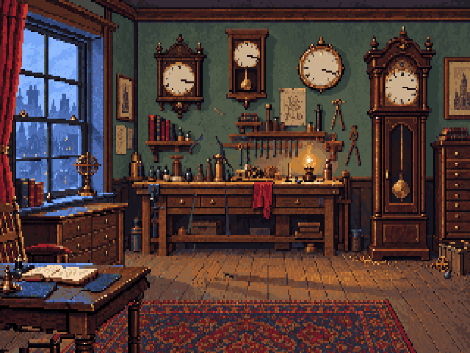
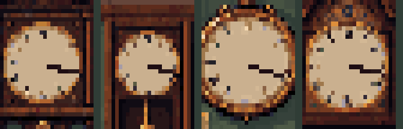

# Clock r12 — walnut surfaces and concealed stair

This review pass finishes the exposed surfaces of the r4 perspective construction.
The same Blender projection supplies all eight angles; this pass changes native
surface drawings and the concealed opening, not the camera or hinge.

[Open the local review](http://127.0.0.1:5176/art/studies/clock-r12/).

- Fixed native UV plates provide walnut grain, inset fields, bevels and rails.
- The reverse of the ornamental front is wood and joinery, never a reversed dial.
- The threshold drops into darkness. Small tread edges sit below its lip, avoiding
  the earlier ascending-looking triangle of steps.
- The room uses r9's corrected cabinet, master v2 Holmes, and separate lamp/clock.
- All four visible dials use explicit 3:17 angles. Small handset clusters are restored
  locally; rims, numerals, clock silhouette and the wider room remain intact.

## Sources and editable files

`textures.ts` draws the native indexed plates; PNG plates and a reverse-front
Pixelorama file are in `source/`. `clock.pxo` contains the eight review
cels. `export-pixels.ts` rasterizes the saved `projection.json` with
perspective-correct nearest sampling and a depth buffer.

The editable camera and rigid volumes remain in
[the r4 Blender source](../clock-perspective-r4/clock-guide.blend); its
[build script](../clock-perspective-r4/build-guide.py) records their construction.
This pass uses that saved projection without changing geometry. It introduces no
new generated imagery. Room/front provenance remains in the r3/r4/v6 sources.

## Reproduce

```sh
pnpm exec tsx art/studies/clock-r12/export-pixels.ts
pnpm art check art/studies/clock-r12/art.json
PIXELORAMA_BIN=/path/to/Pixelorama pnpm exec tsx art/studies/clock-r12/verify-native.ts
pnpm exec tsx art/studies/clock-r12/compress-gifs.ts
```

`report.json` records hinge drift, camera fit, cel bounds and dial endpoints.
A zero closed-reconstruction difference means this pass reconstructs its own corrected
closed room; it does **not** mean no pixels changed from v6. Pixelorama verification
compares each exported RGBA cel independently.

## Handoff limits

Review only; the gameplay resources remain separate. View 221 keeps an 88×168
canvas, anchor [60,150], placed at world [292,150] (top-left [232,0]).
The opening is a separate background surface covered by the closed clock.

The [r11 contact gesture](../holmes-r11/README.md) still needs choreography
against the case travel. The r9 moving pendulum uses its own full-case images;
it now uses this same dial correction in all 24 cels and its linked native housing.
The standalone stair room and threshold transition are later deliverables.

## Clean-room handoff correction

The earlier background-study.png is a review composite containing Holmes and the
lamp. **Do not use it as the runtime background.**

Use these native exports:

| Purpose | File | Placement |
|---|---|---|
| Corrected r9 base, original passage | [workshop.png](../workshop-r9/export/workshop.png) | 320×200, [0,0] |
| Corrected base with r12 descending threshold | [background-clean.png](export/background-clean.png) | 320×200, [0,0] |
| Corrected pendulum case | [pendulum-00.png](../workshop-r9/export/pendulum-00.png) through pendulum-23.png | 64×140, anchor [30,136], world [268,150] |
| Opening case | clock-00.png through clock-07.png in export/ | 88×168, anchor [60,150], world [292,150] |

The clean backgrounds contain no Holmes, lamp actor, or grandfather-clock actor.
Keep the existing foreground, lamp and Holmes as separate layers/actors. With the
r12 reveal background, show either the r9 closed pendulum case or the r12 opening
case; do not draw both. Their different anchors place the same closed artwork at
world top-left [238,14]. Clock activation remains controlled by the story.

The three wall-clock corrections now live in r9's clean base and in a separate
wall-clock-hands.png repair layer. Its cabinet.pxo includes the repair as a third
layer. Pendulum.pxo keeps the corrected housing linked while the bob animates.
Both builders use art/source/clock-dials.ts, so regenerating them retains 3:17.

background-clean.pxo is an editable clean reveal master. Run check-handoff.ts
after the r9/r12 builds to verify no changes outside the handsets/case, all 24
pendulum dials matching r12, and an exact closed reconstruction. The native export
verifiers cover the updated room, pendulum and clean reveal masters.




Rebuild r9 first, then r12; run:

~~~sh
pnpm exec tsx art/studies/clock-r12/check-handoff.ts
pnpm art check art/studies/workshop-r9/art.json
pnpm art check art/studies/clock-r12/art.json
~~~
