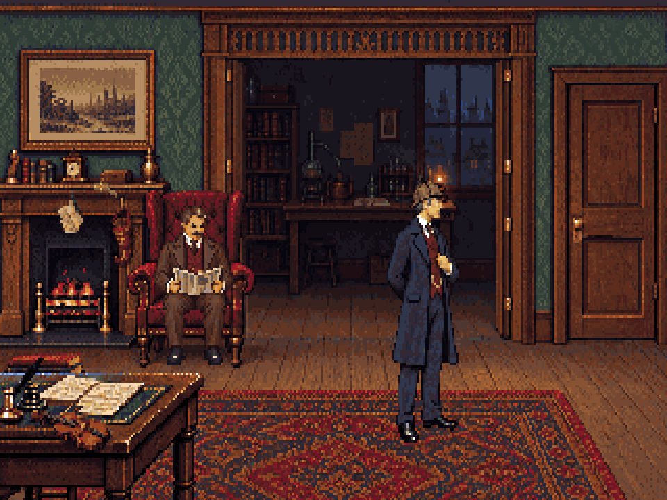
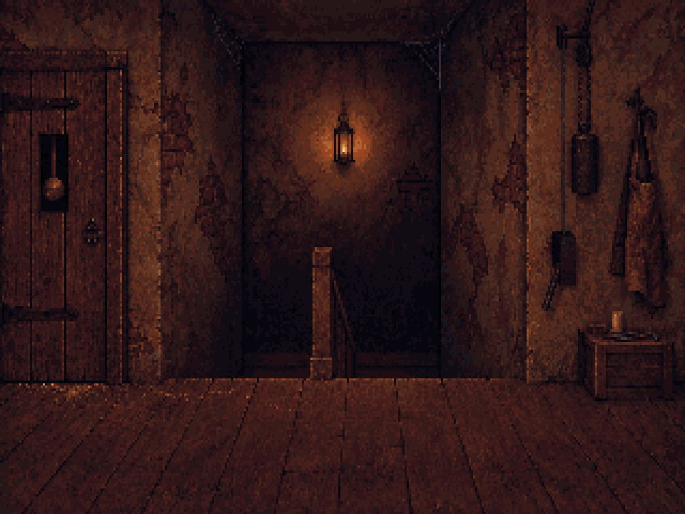
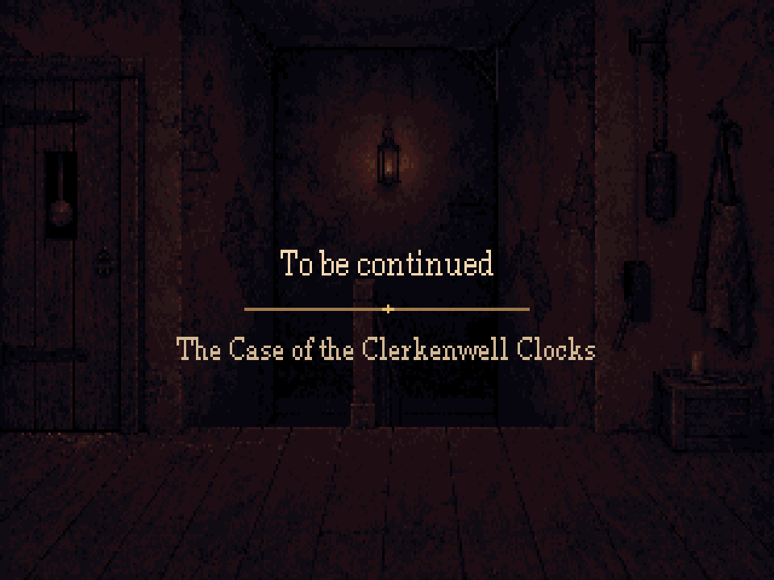

# Environment follow-ups — r43

This study implements [the room follow-ups brief](../../../docs/room-followups-brief.md)
against the room versions now in the game: 221B r33, workshop r34 and stair r40.
[Open the review page](index.html) for the four results and animation close-ups.
Production registration and room scripts are unchanged; this is an art handoff.




## 221B: three missing objects

The correspondence is pinned by a jackknife beneath the mantel clock. The Persian
slipper hangs beside the fireplace, and the violin lies on the near edge of the writing
table. The parked violin line should say table rather than chair when restored.
All three are background details with clickable bounds, not new view resources.

Only three saved polygon masks are replaced in the original room. Outside those
masks, the native background pixels are identical to r33. The foreground table
layer includes the violin. A small priority-137 mantel layer preserves the slipper
and letters over the edge of the fire's opaque patch. Keep the doorway, chair,
seated Watson and atmosphere views from r33.

| Object | Hotspot rectangle, native x1/y1/x2/y2 |
|---|---|
| Letters and jackknife | [26,75,42,95] |
| Persian slipper | [53,79,66,107] |
| Violin | [14,161,55,183] |

[221B handoff](guides/221b-handoff.json) identifies the exact background and foreground
replacements. The first generation placed the letters on the picture and made the
violin overhang the table. `generated/221b-first.png` retains that rejected pass;
`221b.png` and its correction prompt are the final source. Small prop extractions
preserve the existing room rather than rerendering unrelated areas.

## Workshop: pendulum, weather and mouse

The original pendulum pixels are traced once, then rotated around a fixed pivot.
A generated clean glass interior fills the area behind the swing. Each cel is an
opaque replacement of the same 30×62 patch, so the previous bob cannot remain visible.
Woodwork, hinges, dial and stopped 3:17 hands remain unchanged. Hide this overlay
before playing any opening cel of view 221; show it only over the closed case.

Rain moves at 16 native pixels per second, confined to the exterior blue pixels of
eight individually measured panes. The mask excludes the frame, sill, books and
armillary sphere. The 64-second sky cycle moves from clear to overcast and back.
Render the scene, sky, then rain each frame; transparent cels must not accumulate.

The mouse reuses r9's complete side-view run poses, with a small lift in back/fur
contrast. It runs horizontally between the recess uprights beneath the workbench.
Two routes reverse the same path, using right- and left-facing cels. Both first and
last placements have zero visible mouse pixels behind the new occlusion mask. This
avoids the previous mismatch between diagonal travel and side-view anatomy.
Wait 18–35 seconds between runs and hide the mouse while waiting. The review GIFs
repeat sooner so the motion can be inspected.

| View | Asset | Placement / timing |
|---|---|---|
| 272 | Pendulum | [257,65], anchor [0,0], 30×62, priority 151, 24 cels at 12fps |
| 270 | Rain | [12,20], anchor [0,0], 55×78, priority 90, 40 cels at 8fps |
| 274 | Sky | Same window patch, priority 89, 16 cels held 4 seconds each |
| 273 | Mouse | 20×10, anchor [10,8], priority 139, 16fps; loop 0 east, loop 1 west |
| — | Mouse occlusion | Full-room layer at [0,0], priority 140 |

The [workshop handoff](guides/workshop-handoff.json) contains paths, priorities,
route endpoints, time values and case-opening visibility rules. Replace the old
one-loop mouse view with the two-loop candidate and update the routing code; do not
assume the old route or old view-275/276/277 placements still fit. The workshop's
base painting, floor and eight case-opening cels remain r34.

## Stair: the passage behind the clock

R40's connected U-return stair, level camera, single central rail and safe upper
landing stay in place. The revised Blender scene changes the furnishings before
the painting: rough clock-back planks, opening mechanism, low tools crate and work
apron replace the domestic doorway, table, umbrella stand, scarf and runner.
The old plaster exposes brick; damp corners carry cobwebs while the way through
stays clear. Scrape marks and brass filings connect the entrance to the top step.
A plain tin lantern lights the back wall. The newel is a simple square post.

`source/stair-planes.blend` retains game, cutaway and plan cameras. The same five
actor scale checks and walkable polygon accompany the painting. The illustration
interprets the blockout rather than being a pixel-exact projection of every surface.
The actor proofs use unchanged Holmes and the revised 97px standing Watson.

| View | Asset | Placement / timing |
|---|---|---|
| 283 | Tin lantern and local light | [121,22], anchor [0,0], 80×76, priority 80; six keys on the supplied 32-step, 120ms timeline |
| 287, proposed | Pendulum through inspection slot | [19,53], anchor [0,0], 13×30, priority 155; 24 cels at 12fps |

The lantern keeps the old patch origin and irregular cadence. Its flame and wall
light are repainted for the new lantern, so update it with the new room. The clock
back occlusion layer has priority 154; the small peek draws above it. Confirm that
new view 287 is available when registering it.

The existing `stairs` and `entranceDoor` hotspots and the upper walking strip are
unchanged. `entranceDoor` now describes the back of the clock. Optional interaction
rectangles for the mechanism, apron and tools are in the
[passage handoff](guides/stair-handoff.json).

## End card

Picture 105 uses the same new passage, dimmed through the shared palette. Lettering
is a separate editable layer: native New Century Schoolbook regular, 12px for
“To be continued” and 10px for the case title. It reads the licensed upstream BDFs
already supplied in typography-r29, preserving glyph metrics and baselines. No font
redesign, supersampling or synthetic styling is involved.



## Rebuild, inspect and learn

The room edits and clean glass plate used the built-in image generator. That step
is neither open source nor deterministic. Exact prompts and outputs are saved in
`generated/`. All subsequent conversion, masks, animation, layout and exports use
Blender, Pixelorama and the repository's TypeScript pixel tools. A hand-painted PNG
can replace any generated input without changing this workflow.

1. Run `build-guides.py` in Blender to inspect the connected flights and fixed camera.
2. Inspect the pinned generated inputs and masks. Do not regenerate unrelated room
   areas when correcting a prop.
3. Run the native build: centre-nearest sampling, the shared 64 colours, binary alpha,
   no dithering and 1.2 vertical display aspect. All room exports remain 320×200.
4. Review both complete scenes and close-ups. A mask can be technically valid but
   still place an object badly; both checks matter.
5. Open any `.pxo` to edit its layers/cels. The 23 projects export 134 PNGs; the native
   verification opens them in Pixelorama and compares decoded pixels.

```sh
"$BLENDER_BIN" -b --python art/studies/environment-r43/build-guides.py
node --import tsx art/studies/environment-r43/build.ts
pnpm typecheck
pnpm art check art/studies/environment-r43/art.json
PIXELORAMA_BIN=/path/to/Pixelorama node --import tsx art/source/verify-study-native.ts art/studies/environment-r43
node --import tsx art/source/compress-study-gifs.ts art/studies/environment-r43/review
```

`build.ts` orchestrates `interior.ts`, `passage.ts` and `workshop.ts`. `common.ts`
contains local conversion and export helpers. Build assertions check unchanged
pixels outside the 221B masks, pendulum boundaries, glass-only weather and mouse
endpoint occlusion. `native-export-check.json` records the separate Pixelorama check.
GIF compression compares decoded frames before accepting the smaller file.
The 12fps GIF previews use an 80ms approximation; the handoff specifies the exact
2-second pendulum loop for the engine.

Register the reviewed pictures/views in their own `art/art.json` commit. Restore the
parked room-100 lines and add the workshop cycle/visibility logic in the engine
session. The root manifest, room YAML, Yarn and scripts are untouched by this study.
