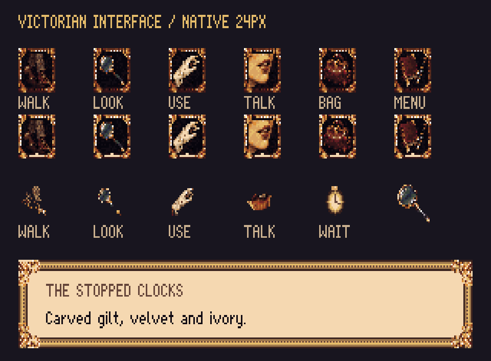

# Victorian interface — r25

2 October 2026. Replaces r20's flat symbols with painted Victorian objects and a gilt surround based on the approved r22 portrait frame. [Open the review](index.html). This is an art study; it is not registered in the production manifest.



## Visual references

- Our [approved portrait surround](../portraits-r22/review/frame.png): warm gilt, carved leaves, beading, dark recesses and top-left illumination. The square buttons share a single bezel taken from the new painted master.
- [Quest for Glory IV interface examples](https://bdferr.github.io/quest-for-glory4.html): observed the toolbar's tight grouping, recognizable pictorial actions and ornament integrated with the controls. This is a secondary reference gallery displaying the game interface. No Sierra assets were downloaded, traced, recoloured or included in the project.

The new objects are original: walking boots, brass lens, ivory glove, speaking lips, Gladstone bag and leather notebook. The wait cursor is a pocket watch. The portrait, room and shared palette are unchanged.

## Delivered assets

| Resource | Contract |
| --- | --- |
| 266 | Six 24×24 cels: walk, look, do, talk, inventory, menu. Loop 0 normal, loop 1 picked. Anchor [0,0]. |
| 260 | Eight **14×14** cels: **TL, TR, BL, BR, top, bottom, left, right**. Anchor [0,0]. Six pixels of edge ink; larger corner leaves. |
| 261–265 | Five transparent 16×16 cursors. Hotspots in art.json and guides/handoff.json. |
| 250 | 24×24 inventory lens, loop 0; 16×16 lens cursor, loop 1. |
| Font 1 | Unchanged r20 ASCII 32–126 sheet, 8×12 cells. Original MIT sci2-ts glyphs. |
| toolbar-skin.png | Optional 320×40 composition reference, unregistered. |

All exports use the existing 64-colour palette and binary alpha. Selected buttons preserve the object pixels and brighten the common bezel, with an ivory lower marker. Cursors come from the same painted objects, with background removal, disconnected-speck cleanup, a lip silhouette and increased boot contrast. The wait cursor is drawn directly at native size.

## Engine handoff

The installed sci2-ts `lib/996.sc` orders frame cels **TL, TR, BL, BR, top, bottom, left, right**. R20 documented a different order. R25 follows the actual renderer. The compiler requires equal canvas dimensions within each loop, so all eight frame cels remain 14×14 even though edge ink occupies six pixels.

`TextItem` uses the full edge canvas for padding. With the existing four-pixel margin, text starts 18 pixels inward. The current `IconBar` uses that padding too: registering this frame by itself makes its panel 68 pixels high. The roomy-layout review shows that outcome. **Asset registration alone does not implement the compact toolbar.**

The proposed compact bar is 40 pixels high, dark velvet rather than paper, with icons at y=8. X positions are 10, 38, 66, 94, then a reserved active-inventory slot at 122, inventory at 150 and menu at 178. The right-hand strip labels the current action. It requires separate toolbar styling/layout in the engine so the larger dialogue-frame margins do not determine toolbar height. The optional skin contains the normal buttons and selected walk for visual reference; a runtime implementation should compose the frame/background and dynamic buttons separately. The preview supports clicking the six buttons to inspect picked states; it is not game logic.

Paper is index 62 (#f5d8b1), ink 2 (#110c14), border 48 (#9f784c), toolbar interior 4 (#18151f). Dialogue preview text is sample copy, not a Yarn change. Register art/art.json separately after visual review, following AGENTS.md.

## Reproduce and edit

The built-in imagegen tool created [the stored master sheet](generated/icon-masters.png), using the approved r22 frame as its only image reference. The [exact prompt](generated/prompt.txt) is retained. The generator is not open source; rebuilding and editing the stored output use open-source tools and do not need image generation or an API key.

`build.ts` records all crop rectangles, point sampling, palette mapping, shared bezel, selected-state edits, cursor masks and border construction. It writes the PNGs, manifest, review scenes and eleven editable Pixelorama projects. Each PNG is a real native-resolution asset, not a CSS pixel effect.

```sh
node --import tsx art/studies/interface-r25/build.ts
pnpm art check art/studies/interface-r25/art.json
PIXELORAMA_BIN=/path/to/Pixelorama node --import tsx art/source/verify-study-native.ts art/studies/interface-r25
```

Open `source/icon-bar-0.pxo` and `source/icon-bar-1.pxo` for normal/picked buttons, `source/box-frame-0.pxo` for frame tiles, or each cursor/lens project. Rebuilding overwrites these generated projects: preserve deliberate native paint edits as new input masters and document them before rebuilding. The unchanged font's editable project remains in r20.

Validation: art compiler checks 28 registered PNGs / 10 resources; TypeScript check; actual Pixelorama CLI exports compared pixel-for-pixel with the expected files. See native-export-check.json for native export results. The unregistered toolbar skin is covered by the native verification as well.

## Typography follow-up

[R26](../typography-r26/index.html) replaces the unchanged r20 font in a separate
review: serif regular, bold, italic and bold italic, plus an explicit inline-style
engine handoff. R25's original screenshots remain as the before comparison.
