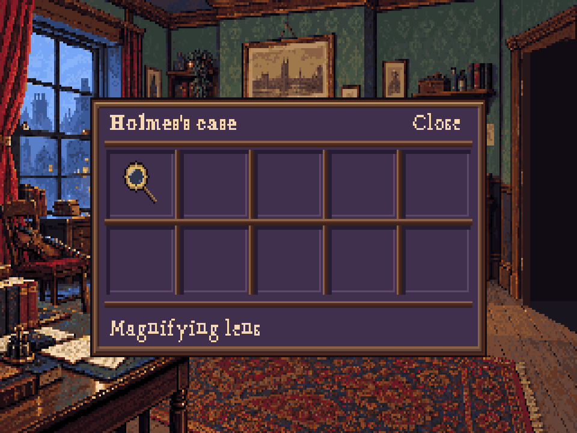

# Wooden case interface — r27

[Open the review](index.html). The user rejected r25's ornate icon frames and requested a wooden box with purple velvet padding and simpler objects in each compartment. This study replaces that UI direction. The approved portrait surround is retained; the room and cast are unchanged.



## What changed

One wooden outer rim and straight dividers replace the repeated carved gold frames. The velvet uses broad shadow/highlight bands, without noisy fabric texture. Icons are drawn directly at 24×24: boot, brass lens, glove, lips, wooden case and notebook. Each is a distinct silhouette with a few material colours. The selected state raises the object one pixel and adds a quiet underline to the cloth.

The inventory contains only the lens, matching items.yaml. Empty compartments demonstrate spacing; they do not imply extra scripted inventory objects. Text uses r26's serif bitmap family. A plain wooden text-frame option accompanies the new case, while the existing portrait remains ornate.

This pass is original native-pixel artwork authored in TypeScript, with editable Pixelorama layers. No image generation, borrowed game resources or new external dependencies are used.

## Assets and handoff

- View 266: six 24×24 action icons; loop 0 normal, loop 1 picked; anchors [0,0].
- View 250: transparent 24×24 inventory lens in loop 0; transparent 16×16 lens cursor in loop 1, hotspot [6,5].
- View 260: eight 8×8 wood-frame tiles in runtime order TL, TR, BL, BR, top, bottom, left, right.
- `object-*.png`: transparent objects without the cloth, useful for skin composition.
- `toolbar-empty.png`: 320×36, with the cloth and wood but no action objects. Its header labels are static review copy; the engine should draw the current action dynamically. Icon x positions 7,35,63,91,147,175, y=6. The active item slot is [119,6].
- `inventory-empty.png`: 220×120, five columns × two rows, slots 38×32 starting [9,24], stepping [41,35]. A 24×24 object is inset [7,4] in its slot. The label strip is separate from the objects. Close is at the top right.
- The composite PNGs are review proofs, not recommended runtime skins: compose objects over the empty skins to keep inventory dynamic.

The engine currently uses a paper TextItem and a single row sized to the number of items. It needs a dedicated case layout and a separate compact toolbar layout to reproduce this study. Merely registering the new icons and frame will not create the grid, velvet or 36-pixel toolbar. Coordinates and requirements are in `guides/handoff.json`. This isolated manifest is not production registration.

## Purple palette proposal

The original 64-colour room palette has no suitable purple ramp. This study proposes **68 colours**, preserving all original RGB values and adding #261d32, #40304e, #604769 and #88688c. The compiler requires white at the end, so white moves from local index 63 to 67; the four new colours occupy 63–66. Preview composites remap that white index explicitly, preserving original room and portrait colours. Production palette and art/art.json remain unchanged. The engineer must merge the new colours and update the shared budget before integrating these assets; do not overwrite index 63 of existing indexed assets without remapping.

## Reproduce and edit

```sh
node --import tsx art/studies/interface-r27/build.ts
pnpm art check art/studies/interface-r27/art.json
PIXELORAMA_BIN=/path/to/Pixelorama node --import tsx art/source/verify-study-native.ts art/studies/interface-r27
```

`source/objects-and-padding.pxo` has separate cloth and object layers across six frames. Normal/picked icon projects, the two lens loops, plain frame tiles and empty/composite case projects are also included. Rebuilding overwrites generated projects; move deliberate Pixelorama edits into stored native masters or the drawing source before rerunning.

Validation: palette/compiler checks, TypeScript, and actual Pixelorama export parity (report in native-export-check.json). PNGs have binary alpha. The original palette colours are asserted unchanged. R26 font derivatives remain OFL-1.1; see that study's FONT-LICENSE.txt. The original object and case artwork and build code are MIT.
