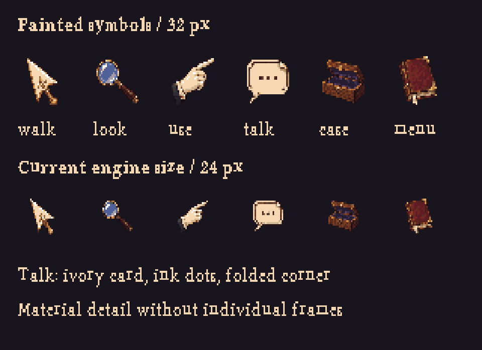

# Painted Victorian symbols — r28

[Open the review](index.html). The user found r27's case too simple and the icons too crude, and asked for less literal symbols, including a Victorian speech bubble. This pass restores painted material detail while retaining the wood-and-purple-velvet direction.



## Direction

The case has walnut grain, bevel depth, restrained brass corner protectors, hinges and a latch. Velvet has broad folds and contact shadows. The icons have no individual ornamental frames. Walk becomes a brass-and-ivory pointer; use is a printer's pointing hand; talk is an ivory speech bubble resembling a folded calling card, with ink dots and a speech tail. Look is a lens; inventory is a small open case; menu is a leather journal.

The preferred **32×32** exports give each object more useful pixels. **24×24** compatibility exports are also supplied for direct comparison, independently sampled from the source master. The room remains 320×200. Changing icon size is a deliberate UI proposal, not a claim that the current engine already supports the new layout.

## Sources and workflow

The built-in imagegen tool produced two original masters, stored in `generated/`: the six-symbol sheet and the empty case. Exact prompts are retained in icons-prompt.txt and case-prompt.txt. The case used our approved workshop v6 as a style reference. No external game artwork was copied. Generation is proprietary; the stored masters, conversion and editable workflow do not require future generation or an API key.

`build.ts` removes the connected purple exterior of each icon cell, measures object bounds, samples to each native size and maps to r27's 68-colour palette. A hue constraint keeps purple cloth in its dedicated ramp rather than mapping it into the room's more numerous brown/red shades. It preserves enclosed velvet inside the small case icon. The empty case is sampled to 256×144 with binary alpha. The toolbar reuses the case's painted rim, dividers and lining patches. Crops and layout measurements are saved in guides/handoff.json.

Ten Pixelorama projects include separate cloth/object layers for normal and selected icons at both sizes, transparent object sheets and empty/composite skins. Rebuilds overwrite generated projects; record deliberate Pixelorama changes as new input masters before rebuilding.

```sh
node --import tsx art/studies/interface-r28/build.ts
pnpm art check art/studies/interface-r28/art.json
pnpm art check art/studies/interface-r28/art-24.json
PIXELORAMA_BIN=/path/to/Pixelorama node --import tsx art/source/verify-study-native.ts art/studies/interface-r28
```

## Engine handoff

The [implementation handoff](../../../docs/art-interface-implementation.md) brings
the font, case, icon layout and palette requirements together. New Century Schoolbook
12px (r29) is now approved for new text; r28's existing caption images retain the
older r26 rendering as historical review output.

- `art.json` is an isolated **32-pixel proposal** for view 266 and the lens icon; `art-24.json` is the size-compatible alternative. Neither is registered in production.
- Engine ICON_SIZE and inventory sizing are currently 24. For the preferred 32-pixel version, change icon size, hitboxes, spacing, active-item slot and toolbar/inventory layout together.
- The preferred toolbar is 320×48. Action x positions are 16,58,100,142,226,268 at y=8; the active item belongs at [184,8].
- Inventory skin is 256×144 at [32,30], four columns by two rows. The preview includes only the scripted lens. Empty skins and objects are separate to permit dynamic composition.
- The isolated view 250 manifest contains only the inventory icon. **Retain the separately reviewed 16-pixel cursor loop when integrating**; this study does not replace the item-cursor contract.
- The 68-colour proposal is unchanged from r27: original RGB values preserved, four purple shades inserted before the final white entry. Production palette and manifest are untouched.
- Use approved r29 typography for implementation; the approved portrait frame remains unchanged. R27's plain wood text frame remains a separate optional resource; no new dialogue border is claimed here.

Checks include both art manifests, TypeScript and Pixelorama native-export parity. The native-export-check.json report records actual decoded-pixel comparisons. Original generated artwork and code follow the project's MIT licence; font derivatives used in review images retain r26's OFL-1.1 licence.
