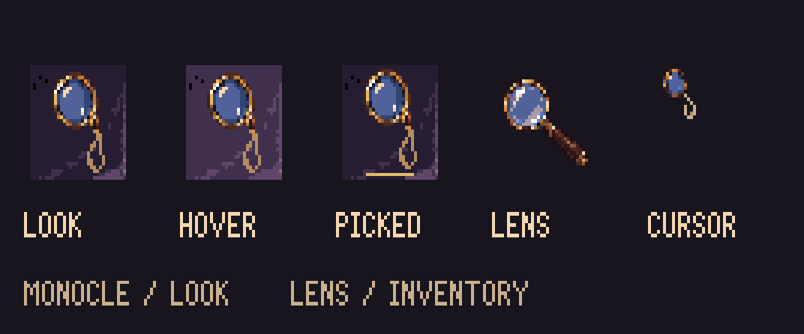

# LOOK monocle — r45

LOOK now uses a brass monocle with a short silk cord. Holmes's inventory lens remains a
handled magnifying glass, so the toolbar and carried item are distinct.

The cord uses pale silk `#cab08f` with `#b68d62` shadow pixels so it stays legible on
purple velvet. The same palette treatment applies to 32px and 24px tiles and the
16px cursor, including normal, hover and picked states.



- View **266**, cel **1** in normal loop 0 and picked loop 1: new 32×32 monocle tiles.
- View **262**: 16×16 monocle cursor, hotspot **[7,5]** at the optical centre.
- The web LOOK button uses normal, hover/focus and picked tiles. Picked retains the gold
  underline; hover brightens the velvet. Input bindings and labels stay unchanged.
- View **250**, all inventory lens PNGs, its cursor/glass loops, and `art/lens/build.ts` retain
  their existing artwork and paths. The old `object-look-32.png` filename remains the lens
  source; do not globally replace that reference.

`generated/monocle.png` is the original transparent ImageGen source; `generated/prompt.txt`
records the exact built-in-tool prompt. `build.ts` crops its alpha bounds, reduces it to
32/24/16px, quantises to the existing 68-colour palette and finishes the small cord so it
stays connected at cursor size. The velvet is extracted from the existing r28 case skin.
Three Pixelorama projects contain the transparent objects and tile states. `native-jobs.json`
records nine exports for comparison with Pixelorama's actual exporter.

```sh
node --import tsx art/studies/interface-r45/build.ts
PIXELORAMA_BIN=/path/to/Pixelorama node --import tsx art/source/verify-study-native.ts art/studies/interface-r45
pnpm check
```

The local production manifest and web page are updated. The public site changes only after
commit, push and deployment. Keep `art/art.json` registration in its own commit per AGENTS.md.
`review/toolbar.png` includes the unchanged lens in the active-item slot for comparison;
that composed image is a proof, not a replacement toolbar skin.
