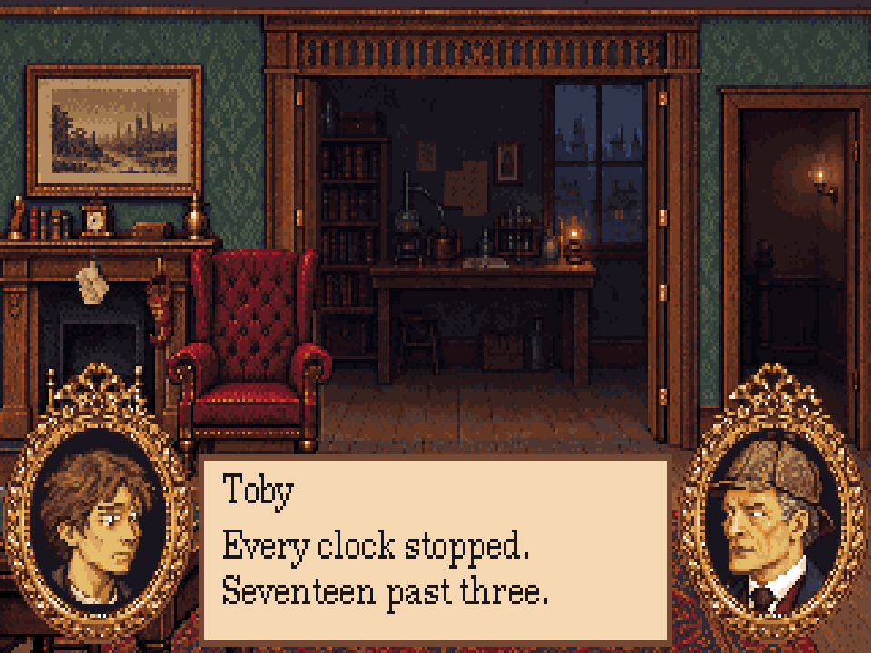

# Portrait expressions — r44

[Open the review](index.html). This is an art study and engineer handoff, not a production
registration. The four approved r23 neutral files are byte-identical. New expressions are
fixed review masters; technical checks do not mean the user has approved their acting.



## Scope and the user's correction

The current scope is **facial acting only**: expressions, talking, blinks and glances.
The user removed the brief's portrait “habits” on 3 October because there is no room for
those gestures in this crop. There are no habit loops, source layers, previews or exports.
The full-body sprites retain responsibility for hand/prop idle gestures. Do not add the
brief's final two habit loops when integrating this study. Do not shrink shoulders or
upper torsos to squeeze gestures into a portrait; the original head and bust crop stay fixed.

## Contents

| Character | View | Expressions in loop order | Loops |
|---|---:|---|---|
| Holmes | 213 | neutral, intent, keen, dry, grave, impatient | 0–35 |
| Watson | 210 | neutral, warm, puzzled, concerned, surprised, resolute | 0–35 |
| Mrs Hudson | 211 | neutral, flustered, kind, startled | 0–23 |
| Toby | 212 | neutral, frightened, tearful, spooked, earnest, relieved | 0–35 |

Each expression has six loops: right bust, right mouths, right eyes, left bust, left mouths,
left eyes. The bust has one cel; mouth cels are closed, slightly open, open and wide; eye cels
are open, half blink, closed blink, toward the other speaker, away and down. `expressions.json`
is the authoritative named mapping. All 484 cels are 56×64, anchored [0,0], with binary alpha
and r27's 68-colour palette. Left coordinates are recorded explicitly as well as right ones.

The r22 surround is still 72×88, at [-8,-18] relative to a face. Mirror only the bust and
its overlays. Draw the surround, then face, mouth, eyes and frame protection in that order.
Restore the bust before applying the current overlays on every frame. Never accumulate cels.

## Reference-first workflow

1. `source/references/*-acting.png` contains ImageGen acting guides, cropped to their facial
   expression rows. These are references, not exported character replacements. The prompts
   are retained in `prompts.json` and `remaining-prompts.json`; they record the original
   generation requests, including a subsequently discarded gesture row.
2. `prepare-masters.ts` translates the facial acting into small native-pixel edits to each
   character's existing r23 master. Forehead/brow, eye and mouth regions are explicit.
   Hair, nose, costume, face outline and bust proportions stay fixed. The neutral PNG is
   copied byte-for-byte. This separate authoring step refuses to overwrite saved masters
   without `--replace-masters`.
3. `models.json` pins each saved expression with SHA-256. `landmarks.json` records its actual
   lip corners and line, chin, eye regions and pupil positions. Raised smile corners and
   lowered frown corners have their own coordinates. Watson's speech remains directly below
   the moustache, with the accepted leftward position and width.
4. `animation.ts` builds cels from those saved masters. Closed mouths and open eyes are exact
   crops of their own expression. Mouth apertures are character-specific. The neutral blinks
   reuse the corrected r23 pixels, including Toby's irregular lower-lid area. Glances move
   irises and lids inside their regions; brows do not move while a glance or blink plays.
5. `build.ts` checks hashes and changed-pixel bounds, exports the PNGs and writes one native
   Pixelorama project per character. The reference master is locked; mouth and eyes have
   separate layers. Surround and frame protection are locked and linked across frames.
   These 72×88 authoring canvases include the frame; engine cels remain 56×64.
6. The actual Pixelorama 1.2.3 exporter is run headlessly. Its 396 composite frames are compared
   pixel-for-pixel with the scripted composites. This verifies the editable source, not just
   the PNGs. GIF compression also compares every decoded frame before replacing a file.

Routine rebuild, from the repository root:

```sh
node --import tsx art/studies/portraits-r44/build.ts
node --import tsx art/studies/portraits-r44/proof.ts
PIXELORAMA_BIN=/path/to/Pixelorama node --import tsx art/source/verify-study-native.ts art/studies/portraits-r44
node --import tsx art/source/compress-study-gifs.ts art/studies/portraits-r44/review
pnpm art check art/studies/portraits-r44/art.json
pnpm typecheck
```

Only when deliberately revising the master reference, edit the preparation source and run
`node --import tsx art/studies/portraits-r44/prepare-masters.ts --replace-masters` before the
routine rebuild. Review the changed masters and hashes. Animation builds never run this step.

## Review and integration

The HTML proof renders a 320×200 room with portraits in the bottom corners and a dimmed
listener. Switch characters, expressions and reactions; swap sides; freeze a mouth/eye cel;
pause playback; inspect both facings and the saved masters. Room presentation uses the game's
1.2 vertical pixel aspect; the exports keep their native dimensions. Text uses the existing
licensed New Century Schoolbook 12px atlas and original metrics from r29.

The talking sequence is a **silent test amplitude**, with closed-mouth pauses. It is not
connected to voice audio. The engine should map recording loudness to the four mouth cels,
close at silence, and choose each line's named expression. Use short half–closed–half blinks
between open holds and occasional glances while listening; avoid cycling every eye cel as a
single animation. Glance direction names are relative to the other portrait; mirrored cels
already give the opposite screen direction.

Toby's frightened/tearful/earnest distinctions and Holmes's intent/grave/impatient distinctions
are subtle at 56×64 and still need an art review in context. Compare the resting face first,
then talking and blink transitions. The 64×72 trial was optional and is not supplied: this
pass keeps the established crop and proportions throughout.

The root `art/art.json`, room scripts and dialogue tags are unchanged. The engineer can use
this study's `art.json` as the candidate resource definition after visual approval. See
[the implementation handoff](../../../docs/art-portrait-expressions-r44.md).
