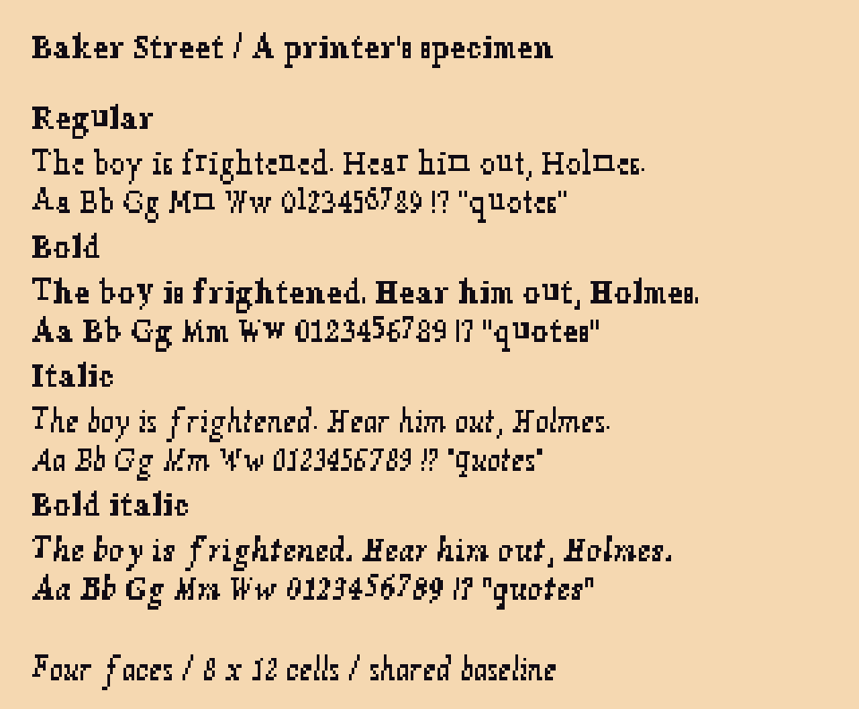

# Victorian typography — r26

[Open the visual review](index.html). Four bitmap faces for the new gilt UI: regular, bold, italic and bold italic. Dialogue samples use the actual lines `100-018` and `100-020`, with proposed emphasis. No room or Yarn changes are included.



## Direction and source

The art direction is nineteenth-century book typography: bracketed serifs, clear thick/thin contrast and a distinct cursive italic, adapted to a small adventure-game grid. This is a modern interpretation, not a claim that this exact face was used in a particular Victorian publication.

The outline source is [Libertinus Serif 7.051](https://github.com/alerque/libertinus/releases/tag/v7.051). Its [upstream project](https://github.com/alerque/libertinus) provides separate regular, bold, italic and bold italic designs under OFL-1.1. No artificial browser slant or blanket pixel dilation is used. The modified bitmap family is called **Baker Street Bitmap** in this study.

The four unmodified upstream TTF files, their authors and licence are stored in `source/upstream/`; checksums are recorded in `guides/rasterization.json`. **The font files, bitmap derivatives and glyph data are OFL-1.1, not the repository's default MIT licence.** Retain FONT-LICENSE.txt with them. Build/preview code is MIT.

## Contract

| Face | Proposed font resource | PNG |
| --- | --- | --- |
| Regular | 1 | export/regular.png |
| Bold | 2 | export/bold.png |
| Italic | 3 | export/italic.png |
| Bold italic | 4 | export/bold-italic.png |

Each sheet is 152×60: nineteen columns, five rows, **8×12** cells, ASCII 32–126. Ink is palette colour 62, transparent background, binary alpha. The renderer recolours the ink. Proportional advance is the rightmost ink column plus one space pixel; space is three pixels. Line height is twelve. All four faces share baseline y=9. Italic overhang is brought inside its cell because the current bitmap format has no negative bearing.

The native sources come from FreeType's monochrome rasterizer at eleven pixels. A twelve-pixel trial needed per-glyph vertical movement; eleven pixels fits all glyphs on the common baseline without vertical adjustment. Only overwide glyphs (mostly M/W and m) are fitted horizontally to eight pixels. The exact list is recorded for review. All 380 cells are provided, with a full glyph proof to make small-scale compromises inspectable.

## Bold and italic integration

The installed `sci2-ts` text kernel's `drawText` and `TextSize` paths use one font per text object. Four sheets can support whole-box font selection now. **Mixed bold/italic within one sentence is demonstrated in this review renderer, but is not implemented in the game engine.** Font registration belongs in a separate art/art.json commit after review.

For the engineer, `guides/sample-runs.json` gives the exact text and face of each run. It is a handoff format, not claimed Yarn syntax. The runtime change should:

- Resolve regular/bold/italic/bold-italic to the four registered resources.
- Measure, wrap and draw the same run sequence using each face's advance widths.
- Carry styles across line wraps, share the baseline, and reset styles after each span.
- Keep speaker-name styling separate from spoken text; do not display markup or send it to speech synthesis.
- Preserve plain-text fallback for unstyled content. This delivery covers ASCII; curly quotes/dashes must be mapped before the bitmap boundary, or added as a separate encoding extension.

Suggested usage: regular for most dialogue, bold for speaker names and short emphasis, italic for publication titles and softer emphasis, bold italic sparingly. The proof uses italic *Standard*, matching the newspaper mentioned in the script. No automatic global boldening.

## Reproduce and edit

Font artwork needs exact glyph metrics, so this pass uses the open-source font/raster tools rather than image generation. Normal rebuilds need only Node and the stored glyph masters:

```sh
node --import tsx art/studies/typography-r26/build.ts
pnpm art check art/studies/typography-r26/art.json
node --import tsx art/studies/typography-r26/verify.ts
PIXELORAMA_BIN=/path/to/Pixelorama node --import tsx art/source/verify-study-native.ts art/studies/typography-r26
```

To deliberately regenerate glyph masters from the pinned outline files, run `python3 rasterize.py` with Pillow 12.3.0 and FreeType 2.14.3, then rebuild. Other rasterizer versions can change pixel placement; checked-in JSON masters make the default build independent of local font rendering.

Edit `source/{face}.json` for explicit native glyph changes; each cell is twelve strings of eight dots/ink marks. The four `.pxo` projects expose the same sheets in Pixelorama. Rebuilding overwrites generated projects, so retain deliberate painting changes in the JSON masters before rebuilding. `guides/metrics.json` records advances used by the preview.

Validation covers registered sheets, all printable ASCII glyphs, compiled SCI resource pixels/advances, equal line heights, distinct style resources and Pixelorama native export parity. The interactive preview switches between all four faces and mixed emphasis at native or enlarged size.
