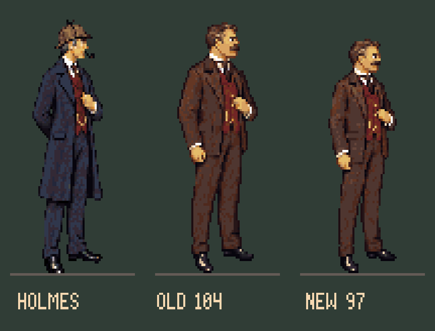

# Watson proportions — r42

Watson's old standing figure was almost as tall as Holmes, with a broader head and
shoulders. R42 keeps Holmes unchanged and redraws Watson with a less imposing build.
The corrected neutral is 97 pixels high, down from 104. Holmes remains 106 including
his deerstalker. These are silhouette heights, not measurements of the men without hats.



Open [the comparison page](index.html) for before/after views in Baker Street r41,
221B r33 and the workshop r34. Each pair stands at equal depth and receives the same
room camera scale, y/176. These are staging proofs, not new runtime placements.

## Textual basis and design choice

[A Study in Scarlet, Part I chapter II](https://www.gutenberg.org/files/244/244-h/244-h.htm)
describes Holmes as over six feet and exceptionally lean.
[Charles Augustus Milverton](https://www.gutenberg.org/files/108/108-h/108-h.htm)
describes the masked intruder who is Watson as middle-sized and strongly built,
with a square jaw, thick neck and moustache. That supports a taller, leaner Holmes
and a sturdy Watson, but does not establish an exact height ratio. The 97px target
is this game's art direction, not a canonical measurement.

## Fixed reference workflow

The built-in image generator edited the original r13 Watson drawing as a complete
figure, gently narrowing the shoulders and reducing the head while retaining his
pose, face, costume and colours. The source and exact prompt are in `generated/`.
The original generation prompt records the initial 99px target; the user then
requested a slightly shorter figure, so the same drawing is now converted at 97px.
This generation step is not deterministic or open source. Conversion and editing
use the existing open-source TypeScript tools and Pixelorama workflow.

`build.ts` samples that checked-in drawing onto the native grid with binary alpha,
the shared 64-colour palette, no dithering and 1.2 horizontal precompensation for
the game's pixel aspect. The 72×120 canvas and [36,113] anchor stay fixed. The bottom
opaque pixel remains y112, as in the old Watson; the registration does not move.

The visible width falls from 40 to 34 pixels. This includes hands and coat contours;
it is not a shoulder-width measurement. The locked master, head crop, SHA-256,
dominant palette indices and source sampling transform are recorded in `model.json`.
The layered/cel editing source is `source/watson-master.pxo`.

Use this neutral to establish future standing and walking poses. Do not fit each
animation frame separately to 97px: stance, knees and stride should move naturally
around its proportions. The portraits and chair-fitted seated reading animation
are separate references and have not been resized.

## Handoff

Candidate view **201** exports `export/watson-standing.png`. Its four-loop contract
matches the current production stand-in: loop 0 right-facing neutral, loop 1 mirrored,
and loops 2/3 the same neutral pending actual front/back poses. This does not deliver
walking or turnarounds. Swap all three PNG references together when integrating;
keep the anchor and room perspective unchanged. Root `art/art.json` is unchanged.

Historical studies retain their old cast. R42's comparison page is the current
review of the proposed replacement, rather than silently modifying archived masters.

## Rebuild and verify

```sh
node --import tsx art/studies/watson-r42/build.ts
pnpm art check art/studies/watson-r42/art.json
PIXELORAMA_BIN=/path/to/Pixelorama node --import tsx art/source/verify-study-native.ts art/studies/watson-r42
```

The build checks the 97px silhouette and unchanged Holmes stature. The native
verifier compares the actual Pixelorama export against the delivered PNG.
