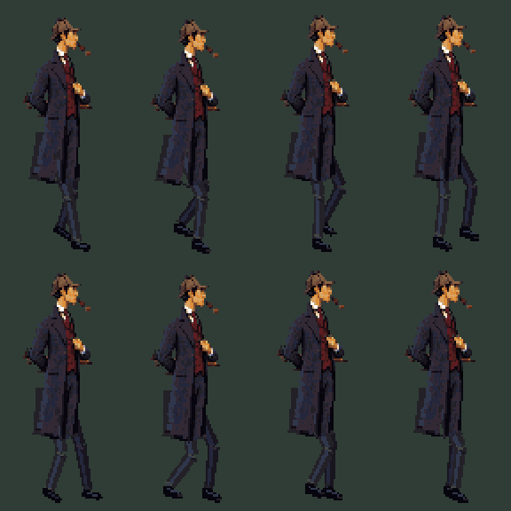
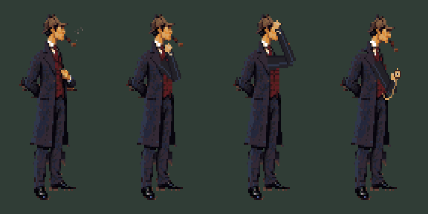

# Workshop r5: perspective, overcoat walk and idle gestures

**Character animation rejected in review.** The user rejected the added-limb anatomy
and requested complete-figure re-rendering before animation. Do not promote this
study's walk or idle cels. The replacement starts in [Holmes r6](../holmes-r6/status.json).
Keep this record as a failed-method example; the desk and interactive prop work are
separate from that rejection.

This is a reviewable art delivery, separate from game integration. Open
**[the interactive preview](http://127.0.0.1:5176/art/studies/workshop-r5/)**.
From the repository root, serve it without building the engine:

```sh
python3 -m http.server 5176 --bind 127.0.0.1
```

The page also works at `/art/studies/workshop-r5/` on the normal development server.
Use **Walk across**, **Pause motion**, and the **Cel** slider to examine poses.
The slider also scrubs whichever idle gesture is playing. **Original desk** compares
the desk planes; **Guides** displays the construction. Select **Use lens**, then click
the filings below the bench to reveal the trail and scratches. The clock, wall clocks
and ledger can be inspected. These are art-preview interactions, not new Yarn logic.

## Review decisions, including a failed draft

The first r5 draft again made a mistake: its legs were constructed in profile while
the approved torso faces partly toward the player. It also treated the lower coat as
a short, mostly rigid jacket. The user identified both issues during the work.

The revised construction turns the walking plane **30 degrees toward the viewer**,
uses a **20-degree downward view** for the leg guide, and gives the near and far legs
separate lateral positions and depth. These are chosen drawing-guide angles, not a
claim to have recovered the exact camera of the painted character. The shoes are
drawn from their projected heel and toe positions; they no longer sit on one profile
baseline. Both long coat skirts overlap the upper legs, with different hems and a
small response to the stride. The original head, hat, pipe and upper costume remain.

The walk is still a new animation study requiring visual review. Constant bone lengths
and planted targets do not, by themselves, establish appealing acting or perfect cloth.



## What this pass contains

| Element | Delivery | Review state |
|---|---|---|
| Foreground desk | Perpendicular tabletop planes, coherent apron edges, vertical leg guides; original texture transferred locally | New perspective correction |
| Holmes | Original standing cel plus eight new three-quarter walking cels; separate far leg, near leg and coat/body layers | Revised after the profile-leg feedback |
| Pipe puff | 12 cels, sparse rising smoke with binary alpha | Idle study |
| Thinking | 17 cels, hand raises to chin, holds and returns | Idle study |
| Cap adjustment | 11 cels, fingers reach the brim, adjust and return | Idle study |
| Pocket watch | 21 cels, watch rises, head inclines, chain becomes visible | Idle study |
| Filings | Patch, then patch plus trail toward the clock | Two separate cels |
| Scratches | Three shallow grooves beside the case | Separate reveal asset |
| Lens | Inventory icon and a smaller cursor with its own anchor | New asset |
| Clock | R4's eight-cel rigid turn | Reused after the user's positive review |
| Lantern | Original housing and four flame states | Reused from r3 |
| Dial inspection | Existing 3:17 close-up | Reused, not repainted |



## How the perspective correction works

`build-desk.py` uses the same shifted 45 mm perspective camera and SCI pixel aspect
as the clock study. It retains the near-right tabletop corner at **[65,176]** and
the far-right corner at **[102,151]**. From those it constructs a horizontal top,
perpendicular directions, apron planes at one lower height, and vertical leg guides.

The two vanishing points are approximately **[-2387,72]** and **[219,72]**. The left
point is far outside the frame: nearly horizontal edges can still converge. The
original front apron sagged toward the lower left independently of the tabletop;
the new lower edge follows the same construction as its upper edge. The correction
is local. It does not regenerate the room or alter the reference file.

`desk.json` contains both the original and corrected quads. A four-point projective
map transfers the original wood and tabletop pixels with nearest sampling. The raised
candlestick is retained separately, so it is not flattened into the tabletop plane.
`export/desk-change-mask.png` records the permitted correction region. The drawing
and depth of the remaining furniture still need review; no automatic whole-room
perspective solution is claimed.

## How the walk is constructed

1. `build-motion.py` defines near and far hip/sole targets in 3D, in the turned walking
   plane. The leg lengths are fixed at **0.675 world units per segment**.
2. A two-segment geometric solve places each knee. The knee bends forward within that
   plane, rather than simply moving to the right in screen space.
3. The Blender armature stores eight poses: contact, down, passing, up, then the other
   half of the stride. The `.blend` packs the original room as a reference.
4. `motion.json` exports the projected hip, knee, ankle, heel, toe and sole points.
5. `export-study.ts` draws new trouser and shoe clusters around those points. It does
   **not** rotate bitmap fragments of the old legs. The two lower coat panels are
   drawn over the thighs with original fabric pixels transferred into their silhouettes.
6. The layered Pixelorama master holds the actual cels. Refine the contour and cloth
   there with onion skins, after copying the generated master to a working file.

At 8 fps the guide advances 4 native horizontal pixels per pose, about 0.658 vertical
pixels toward the player, for a 32-pixel horizontal stride. The preview's **Walk across**
uses that same diagonal travel. During the flat-contact portion of stance, the model's
sole position plus actor travel stays fixed in both screen axes. Raster rounding can
still introduce a one-pixel difference; the guide calculation is not a blanket claim
that every rendered shoe pixel remains still during heel strike and toe-off.

The new sprite canvas is **72×120**, anchor **[36,113]**. The figure is not rescaled:
four transparent rows were added beneath the old 72×116 canvas to accommodate the
projected near foot. The original standing pixels are unchanged. In-room placement
at **[144,165]** still uses image origin **[108,52]**.

## Idle acting and scheduling

`build-idles.ts` draws restrained gestures on the original standing cel. It preserves
the lower coat and planted feet. The pipe effect uses palette pixels and disappearing
clusters, not partial alpha. The watch chain is visible while the watch is out; a
permanent chain has not been painted onto the approved standing cel.

Each gesture starts and ends at the standing pose. For engine integration, choose an
idle infrequently while Holmes is stationary, play it once, then return to standing.
Movement should interrupt it promptly. Avoid a fixed repeating sequence of all four.
The preview buttons intentionally make each gesture easy to trigger for review.

Additional ideas to consider later: a brief glance toward a sound, brushing dust from
a sleeve, or a small satisfied nod after a deduction. They have not been drawn in
this pass. Reaching to open the clock and kneeling with the lens remain separate
story gestures under view 204.

## Files and reproducible commands

Use **Blender 4.5.14 LTS**, **Pixelorama 1.2.3**, and the repository's pinned Node/pnpm
environment. No new AI generation was used for this pass. The reused reference and
hidden-surface material retain their earlier provenance; see `credits.csv`.

```sh
blender --background --python art/studies/workshop-r5/build-desk.py
blender --background --python art/studies/workshop-r5/build-motion.py
blender --background art/studies/workshop-r5/walk-construction.blend --python art/studies/workshop-r5/verify-motion.py
pnpm exec tsx art/studies/workshop-r5/export-study.ts
pnpm exec tsx art/studies/workshop-r5/build-idles.ts
pnpm exec tsx art/studies/workshop-r5/verify-native.ts
pnpm typecheck
pnpm art check art/studies/workshop-r5/art.json
```

Set `PIXELORAMA_BIN` to its executable if it is not on PATH. On macOS Blender's
executable is normally `/Applications/Blender.app/Contents/MacOS/Blender`.

The build scripts overwrite **this study's** generated sources and exports. Copy a
Pixelorama master before manual refinement. `export-study.ts` rebuilds the manifest
without idle loops; run `build-idles.ts` afterwards to register those loops. The native
verifiers read the saved projects and export to temporary directories; they only add
their JSON reports to the study. Blender backup `.blend1` files are ignored locally.

| Source | Purpose |
|---|---|
| `desk-construction.blend`, `desk.json` | Editable planes and their pixel-space quads |
| `walk-construction.blend`, `motion.json` | Editable leg armature and projected pose guides |
| `source/holmes.pxo` | Layered standing and eight-cel walk |
| `source/walk-guides.pxo` | Pose and contact overlays |
| `source/idle-*.pxo` | Four separately editable gesture sequences |
| Other `source/*.pxo` | Room layers and independent interactive props |
| `art.json`, `palette.json` | Standalone SCI asset manifest and shared palette |
| `report.json` | Perspective, scale and contact checks |
| `native-motion-check.json` | Reopened Blender armature matches exported joints |
| `native-export-check.json` | 13 Pixelorama masters, 90 exports, identical decoded pixels |

## Engine handoff

This study does not overwrite the active `art/art.json`, room YAML, Yarn, navigation
or compiled resources. Its manifest contains the real files for review and migration.

| Resource | Loops/cels | Anchor and placement notes |
|---|---|---|
| Picture 102 | Base + near desk at provisional priority 181 | Full-size 320×200 layers |
| View 200 | East: standing + 8 walk; west: mirrored east | [36,113], 72×120; eight-cel cadence needs explicit integration |
| View 206 | 0 puff, 1 think, 2 cap, 3 watch | Same canvas and anchor as Holmes; newly reserved idle view |
| View 220 | 4 lantern cels | [10,25], reference position [213,105] |
| View 221 | 8 clock cels | [60,150], reference position [292,150], same as r4 |
| View 227 | Patch / trail | [36,18], reference position [229,164] |
| View 228 | Scratch marks | [8,11], reference position [249,157] |
| View 240 | Dial close-up | [0,0]; no new 224 compatibility alias in this study |
| View 250 | Icon / lens cursor | Icon 24×24 at [0,0]; cursor 16×16 at [6,6] |

North/south walking, Holmes's local age adjustment, Watson, story gestures and room
integration remain outstanding. All PNGs use the shared 64-colour palette and binary
alpha. Technical checks are complete; these new poses and corrections still need
visual review.
