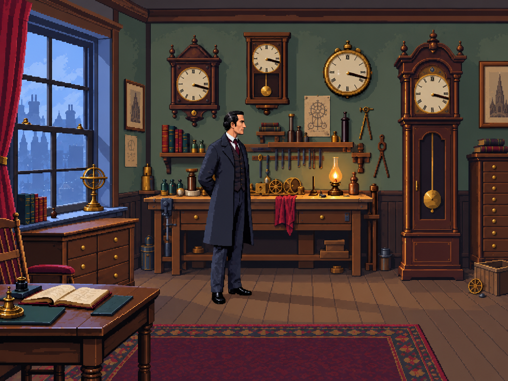

# Workshop rendering study — second art pass

1 October 2026. Primary references: The Lost Files of Sherlock Holmes (Serrated Scalpel
and Rose Tattoo) and Return of the Phantom. Original room composition derived from the
project's workshop prototype; no reference-game images were used as generation inputs.

## Current review candidate

`illustrated.png` responds to the user's latest correction: believable geometry and
natural adult proportions, with a visibly drawn treatment between cartoon and photographic
realism. Quieter plaster and floor surfaces, simplified coat folds and face planes,
restrained material highlights and selected period detail replace the earlier microtexture.
The current candidate has not yet been approved by the user.

## Earlier candidates

- `composition.png`: first naturalistic composition; too photographic for the desired style.
- `pixel-treatment.png`: more visible pixels, but retained too much photographic detail.

These are generated concept studies, created with the built-in OpenAI image generation
tool. Exact prompts are saved in `prompt.txt`, `pixel-treatment-prompt.txt` and
`illustrated-prompt.txt`, respectively. Each later study used the previous image as its
edit target. Seeds/model version were not exposed by the tool. Generation is optional
concept exploration, not an open-source production dependency or a reproducible game build.

## Production boundary

These flattened images are review references, not SCI resources or layered Pixelorama
masters. Their pixel grid, palette size and clock-hand accuracy are not guaranteed by
the prompt. The playable game still uses the original validated assets.

After settling the rendering, separately author the 320×200 background, foreground,
standing/walking Holmes, lantern and hinged clock in the established Pixelorama workflow.
Recheck actor scale against the walking plane, reduce oversized wall-clock faces if needed,
paint a readable filings clue, and construct every 3:17 dial precisely. The reveal needs
an unobstructed background underneath the clock. Update YAML hotspots and walk geometry
for the replacement composition, then rerun native export checks and the gameplay test.
