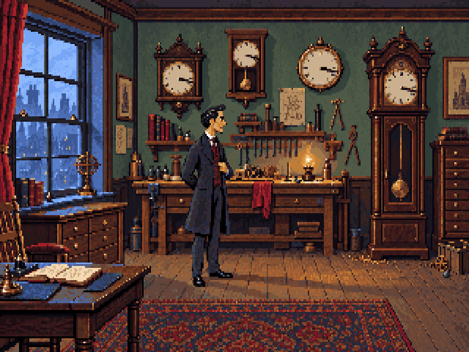
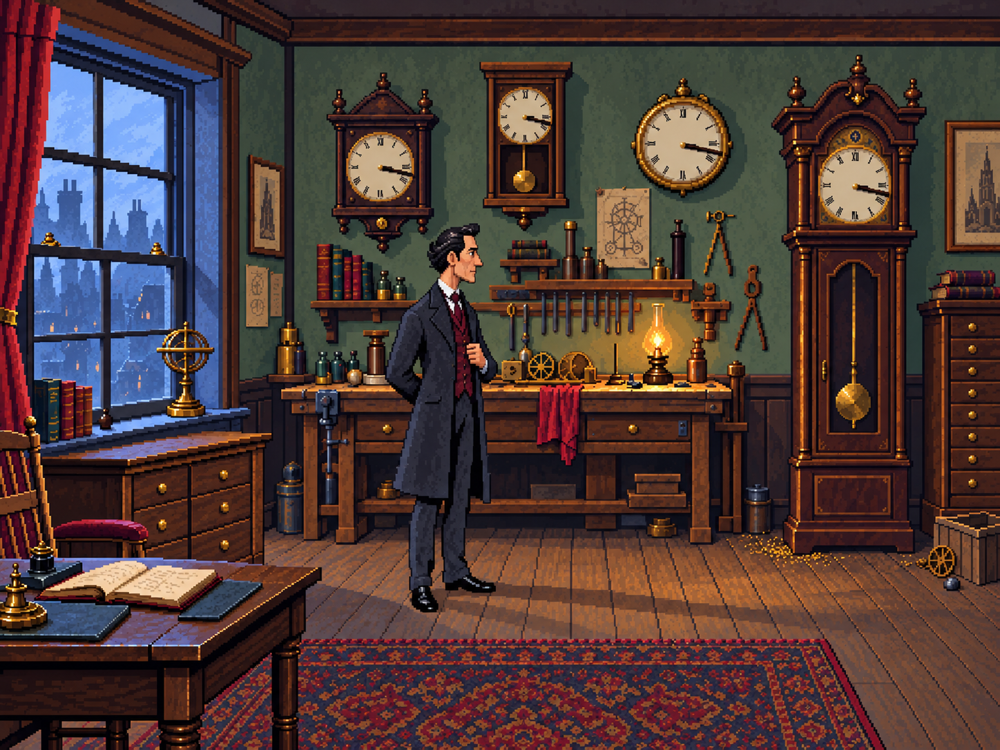

# Workshop version 4 — LucasArts proportions

## Actual resolution and palette conversion

The user requested a real conversion of the existing image. `converted/workshop-320x200.png`
is now exactly **320×200**, uses **64 opaque RGB colours**, and passes the SCI art importer
with `maxColours: 64`. `converted/workshop-4x3.png` is its 960×720 nearest-neighbour
display preview with vertical pixel-aspect correction; it contains no additional detail.



Reproduce from the repository root:

```sh
node --import tsx games/sherlock/art/studies/workshop-v4/convert.ts
pnpm art check games/sherlock/art/studies/workshop-v4/converted/art.json
```

The deterministic TypeScript converter uses nearest-neighbour reduction, weighted median
cut for 62 scene colours plus black/white, and palette mapping without dithering. It saves
the exact candidate palette as JSON and GPL, an isolated import manifest, and measurements
in `converted/report.json`. It uses the existing PNG codec, requiring no new dependency
and no additional image generation. This palette is derived once from the approved colour
direction for review; it does not replace the game's current shared palette automatically.

This is a flattened converted study: Holmes, light and props are baked in. It is not yet
an animated scene replacement. Native pixel cleanup, separation into layers/sprites and
precise clock-hand correction remain necessary. The original full-size concept follows.

## Original generated concept



User direction, 1 October 2026: rendering between generated versions 2 and 3, but less
realistic proportions, drawing on LucasArts Indiana Jones and Monkey Island. The prompt
interprets those series as Fate of Atlantis and early Monkey Island.

This candidate gives Holmes a more expressive profile, larger head and hands, stronger
coat silhouette and visible lapel gesture. Background texture lies between the previous
two treatments. The room retains coherent depth with modestly emphasized furniture shapes.
It is a review candidate; no visual approval or production readiness is claimed.

Generated using the built-in OpenAI image generation tool. [Exact prompt](prompt.txt).
Input 1: `../workshop-v2/pixel-treatment.png` (version 2).
Input 2: `../workshop-v2/illustrated.png` (version 3).
No LucasArts game artwork was supplied as an image input. The supplied inputs are our
original generated workshop studies. Model version and seed were not exposed by the tool.

This is a flattened concept image, not an exact indexed palette, native 320×200 pixel
grid, layered Pixelorama master or SCI resource. Preserve the existing open-source build
workflow. Production adaptation still requires separately authored room layers, sprites,
precise 3:17 dials, legible filings, updated placement and walk geometry, and export/play
checks. The original playable prototype remains unchanged.
