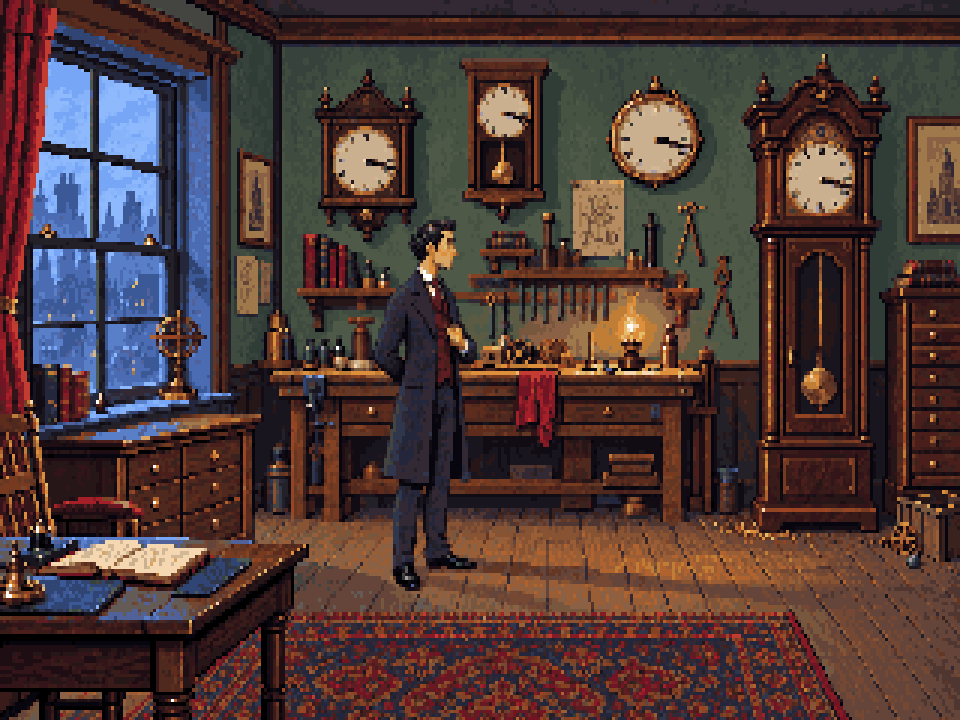

# Version 5 — natural character proportions, approved pixel treatment



User refinement, 1 October 2026: the constrained version 4 looks good, but Holmes's
body proportions should be more realistic. This supersedes the six-head cartoon anatomy
request while retaining the drawn pixel treatment, room composition and colour direction.

The edit targets a smaller head and visible hand, more natural shoulders, neck and
torso/leg balance, and a less exaggerated profile. The pose and costume remain consistent.

`converted/workshop-320x200.png` is the actual native image; the preview above enlarges
it to 960×720 with nearest-neighbour aspect correction. Both use exactly 64 colours,
with the palette copied unchanged from version 4. The converter restricts changes to
the character area `[122,59,161,165)`; every pixel outside it matches the approved version.
The surrounding background inside this edit rectangle can also differ. Measurements and
import validation are recorded in `converted/report.json`.

The character edit used the built-in OpenAI image generation tool with the version 4
source and native conversion as inputs. [Exact prompt](prompt.txt). The raw returned
image is `workshop-source.png`; `convert.ts` performs deterministic reduction, fixed-palette
mapping and restoration of the room outside the edit area. No new palette was generated.

```sh
node --import tsx games/sherlock/art/studies/workshop-v5/convert.ts
pnpm art check games/sherlock/art/studies/workshop-v5/converted/art.json
```

This remains a flattened visual candidate, awaiting feedback, rather than layered
production assets. The playable prototype is unchanged. Sprite separation, animation,
native pixel cleanup and precise clue drawing remain production work.
