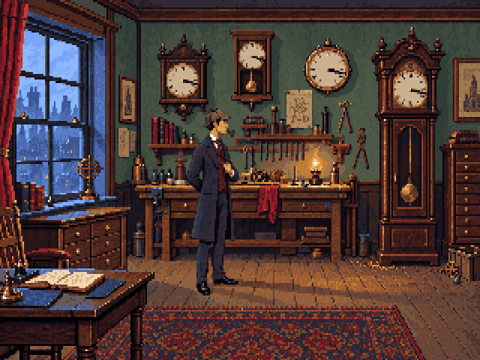

# Version 6 — deerstalker and pipe



User request: add Sherlock's hat and pipe to the latest image. Version 6 adds a fitted
muted brown deerstalker and a small curved pipe held in his mouth, preserving the lapel
gesture and the more natural body proportions from version 5.

The actual image is `converted/workshop-320x200.png`, exactly 320×200 with the unchanged
64-colour palette. The preview is its nearest-neighbour 960×720 aspect-corrected display.
Only the head/accessory rectangle `[135,59,158,77)` is replaced; every body and background
pixel outside that rectangle is copied unchanged from version 5. The importer accepts
the result; measurements are in `converted/report.json`.

The source edit used the built-in OpenAI image generation tool with the version 5 source
and native image as inputs. [Exact prompt](prompt.txt). The raw result is
`workshop-source.png`. `convert.ts` reduces and maps only the accessory area to the
existing palette, so the rest of the generated image cannot alter the approved scene.

```sh
pnpm tsx art/studies/workshop-v6/convert.ts
pnpm art check art/studies/workshop-v6/converted/art.json
```

This remains a flattened study, not an animated replacement for the playable prototype.
Carry the deerstalker and pipe into the eventual separate Holmes sprites.
