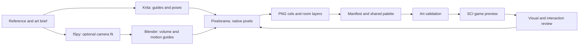

# Learning the Sherlock art pipeline

This project is a worked example of making a classic point-and-click adventure with
an open-source engine and art tools. The aim is to make the decisions, source files,
mistakes and checks understandable enough for another person to repeat the process.

Start here for the learning path. Use the [graphics contract](art-workflow.md) for
exact export rules, the [animation and perspective workflow](animation-workflow.md)
for construction details, and the [asset specification](visual-spec.md) for resource IDs.

## What you can reproduce now

| Part | State | Evidence |
|---|---|---|
| Approved style and scale | V6 is the reference; local perspective corrections are requested | [Reference and review decisions](../art/approved/workshop-v6/README.md) |
| Extracted artwork | R3 separates the original figure and props; the standing reconstruction matches the reference | [R3 sources and report](../art/production/workshop-r3/README.md) |
| Pixelorama export | Version 1.2.3 has been checked against native PNG exports | [R3 native export results](../art/production/workshop-r3/native-export-check.json) |
| Fixed character identity | One exact r6 master, material ramps, native linked cels and a stronger smoke-only animation; 36 native exports checked, including the background pipe-remnant repair | [Fixed master, drawing template and drift diagnostics](../art/reference/holmes-master-v1/README.md) |
| Walking and idle motion | R6 poses established the model. R7 maps joints and renders complete figures, but head/colour/width drift requires redraws against the fixed master | [Earlier anatomy-guided animation and saved prompts](../art/studies/holmes-r7/README.md) |
| Historical costume | 1895 clothing brief separates Doyle's pipe descriptions, museum evidence and visual interpretation | [Costume and pipe sources](holmes-costume.md) |
| Desk perspective | Same local perspective camera as the clock; corrected tabletop/apron planes and before/after preview | [Desk construction and textures](../art/studies/workshop-r5/README.md#how-the-perspective-correction-works) |
| Krita perspective/pose guides | Selected workflow; project guide documents have not been produced yet | Exercises below and official tool manuals |
| Blender scene and hinge | Local camera, rigid volumes, eight poses and pixel export delivered; side drawing and approval pending | [Reproducible clock study](../art/studies/clock-perspective-r4/README.md) |
| fSpy camera matching | Optional; no whole-room camera solve delivered | [Construction plan](animation-workflow.md#clock-construct-the-turn-in-space) |

The running game currently uses a separate, older art set. The R3 review is not a
claim that its artwork has been integrated into the room's walking and interaction logic.

## Choose tools by the problem

| Tool | Learn it for | Save and hand off |
|---|---|---|
| **Krita** | Draw room construction guides and rough animation poses | `.kra` project, `.paintingassistant` guide set, PNG guide frames |
| **fSpy**, optional | Fit a camera from selected image directions | `.fspy` project and the chosen input image |
| **Blender** | Build simple volumes and check a rigid object's movement in space | `.blend` scene, camera/hinge notes and PNG guide frames |
| **Pixelorama** | Draw the final pixels and inspect adjacent animation cels | `.pxo` master and native-size PNG cels |
| **Project TypeScript tools** | Validate and package approved exports for SCI | Manifest, palette, checks and compiled resources |

Krita and Blender use GPL licenses, Pixelorama uses MIT, and fSpy identifies itself
as open source. Use the official [Krita](https://krita.org/en/download/),
[Pixelorama](https://pixelorama.org/), [fSpy](https://fspy.io/) and
[Blender](https://www.blender.org/download/) distributions. The researched feature and
license sources are collected in [the tool decision](animation-workflow.md#open-source-tools).

Pin **Pixelorama 1.2.3** for the existing native export mapping. The clock construction
uses **Blender 4.5.14 LTS** and saves its reproduction commands with the study. For
other tools, record actual application and add-on versions when producing a study. Check fSpy
importer compatibility with the Blender version used before relying on the handoff.

Reading the PNGs and running the game do not require the drawing applications.
The project used proprietary OpenAI ImageGen for some concept and hidden-surface
sources. Those sources and prompts are saved, so reproducing existing conversions
does not require a model call. AI generation is optional and is not the open-source
part of this workflow. See the per-delivery credits for provenance.

## How the files travel



A **master** is the editable source. An **export** is a file the game consumes.
A **cel** is one image in an animation. An **anchor** is the point inside that cel
placed at the actor's room position. A **guide** helps construct artwork and is hidden
when exporting. Keeping these separate makes corrections repeatable.

## Exercise 1: inspect the existing example

Follow the repository [setup instructions](../README.md#setup), then run from its root:

```sh
pnpm install
pnpm art check art/production/workshop-r3/art.json
pnpm dev
```

Open `/art/production/workshop-r3/` on the local server shown by Vite. Compare the
standing pose with v6, then play and step through the walk. Use the native-grid and
greyscale controls. Open the clock. Inspect the isolated assets as well as the room.

**Expected result:** the R3 manifest currently checks 21 listed images, 64 palette
entries and five compiled resources. The standing reconstruction matches v6, while
the walk and clock still expose motion problems. These are different kinds of evidence.

To inspect editable sources, open the R3 `.pxo` files in Pixelorama. Use a copy if you
want to experiment. The reconstruction command below rewrites the R3 masters and exports:

```sh
# Reproduce the saved extraction study; preserve any hand edits first.
node --import tsx art/source/reference-r3.ts
```

This command reconstructs a recorded experiment. It is not the export command to use
after drawing improvements into those masters. The root `pnpm export-art` currently
targets `art/source/`, not the separate R3 delivery; see the [native export mapping](art-workflow.md#native-master-export).

## Exercise 2: construct the foreground desk

Open the [4:3 reference](../art/approved/workshop-v6/workshop-4x3.png) in Krita as a
locked reference layer. Create a separate construction layer. Keep the original file.
Use the Assistant Tool and its Tool Options to add vanishing-point or two-point
perspective guides; the official [assistant guide](https://docs.krita.org/en/user_manual/painting_with_assistants.html)
explains their handles and snapping.

Establish a candidate horizon from multiple reliable edges. Draw a simple box for
the desk before drawing its ornament. Give the tabletop thickness; place its apron
and legs using that same box. Compare the troublesome left side against the guides.
Rotated furniture may have different vanishing points from the walls, but horizontal
directions still share an eye-level horizon. Save the `.kra` and use the Assistant
Tool's save control for a `.paintingassistant` file.

**Expected result:** a construction overlay and a proposed local correction mask.
The tabletop, frame and leg attachments describe one volume. No full-room repaint is
needed to evaluate the geometry. A guide fitted to one convenient edge alone is not
enough evidence that the construction is consistent.

Pixel aspect matters. Our game stores **320×200**, but displays it at **4:3**. The
960×720 reference uses `display x = native x × 3` and `display y = native y × 3.6`.
For example, native point `[100,150]` appears at `[300,540]` in that reference.
Map guide positions back to the native grid before final pixel drawing. Preserve the
original native image outside the intended edit area; do not resample the whole painting
just to transfer a few construction lines.

## Exercise 3: plan a walk before painting its detail

Keep Holmes's approved standing pose visible as the model for proportions and scale.
Use Krita for a rough pose study or draw directly in Pixelorama. Both provide onion
skinning: ghost images of neighbouring frames that help compare positions and shapes.
Use the official [Krita walk lesson](https://docs.krita.org/en/user_manual/animation.html)
and [Pixelorama timeline guide](https://pixelorama.org/user_manual/user_interface/timeline/)
for the editor controls.

Plan contact, down, passing and up poses for each half of the stride:

- **Contact:** the leading heel meets the ground as the trailing foot finishes its step.
- **Down:** the body settles as the leading leg accepts weight.
- **Passing:** the free leg passes the support leg, clearing the floor.
- **Up:** the body rises before the next contact.

Begin with clear silhouettes and a ground guide. Track feet and pelvis before adding
the coat's movement. Check the loop boundary with onion skins. Draw the head, torso,
shoulders and hem response rather than keeping a rigid torso over rotating leg scraps.
Eight working poses are a useful study; the existing six walking cels are not a reason
to omit pose planning. Agree the final cel count and playback timing at integration.

Then translate the figure across the floor. During the planted part of a step, the
support foot should remain in the same world position. This is why an in-place loop
alone does not prove that a character will walk without sliding.

An illustrative calculation, **not the approved timing for Holmes**:

```text
world foot x = actor x + cel foot x − anchor x
frame A: 144 + 22 − 36 = 130
frame B: 148 + 18 − 36 = 130  ← the same planted point

6 cels × 0.160 seconds = 0.960 seconds per cycle
24 pixels travelled per cycle ÷ 0.960 = 25 pixels/second
```

**Expected result:** a rough loop with understandable weight transfer, foot clearance,
stable limb lengths and ground contact, both stationary and moving. Paint final
clusters only after those tests work. Editor frame durations do not automatically
become SCI timing; the [export contract](art-workflow.md) explains that boundary.

## Exercise 4: give the clock a physical hinge

Use the approved closed pose as the target. A simple Blender box or hinged panel is
sufficient to test the volume; decorative modelling is unnecessary for this study.
Fit a camera to the reference construction. fSpy is optional when selected edge
directions support a consistent fit; its [official importer](https://fspy.io/#importing-to-blender)
can transfer the camera and background image into Blender.

Place the object's rotation pivot on the intended hinge. Give it thickness and the
side/back faces exposed during opening. Establish closed, quarter-open, half-open
and fully-open guide poses, then render guides for drawing the final pixel cels.
Check the hinge, top and bottom edges, revealed passage and overlapping furniture.

**Expected result:** one rigid object turns through space. Its hinge stays put and
new surfaces become visible. The first cel retains the approved closed appearance.
In the old experiment, multiplying image width by `cos(angle)` made a flat card get
narrower; it never constructed those missing surfaces. More frames of that operation
would make a smoother version of the same geometric error.

## Exercise 5: finish, export and review

Use Pixelorama for final drawing at native resolution with the shared palette. Keep
the same canvas and anchor across a loop. Hide guide layers and export without trimming,
smoothing, colour conversion or partial transparency. Compare the exports in their room.

For the main game's mapped masters, the established commands are:

```sh
# Requires Pixelorama 1.2.3 via PIXELORAMA_BIN or PATH.
pnpm export-art --check  # compare decoded master exports with existing PNGs
pnpm export-art         # validate and replace the main PNG exports
pnpm art check art/art.json
pnpm preview            # scripted workshop playthrough and review frames
```

For a separate study, validate its own manifest instead. Register it in the game's
manifest and export mapping only as a deliberate integration step. Room placement,
obstacles, hotspots, depth and playback speed belong to the engine-side handoff.

**Expected result:** reproducible exports plus two kinds of review:

| Technical checks | Visual and gameplay review |
|---|---|
| Palette, alpha, dimensions, anchors and file mapping | Likeness, proportions, perspective and readable clues |
| Master/export pixel equality | Pose quality, weight transfer and loop continuity |
| Reference preservation outside edit masks | Foot contact, occlusion and timing in the moving game |

## What the unsuccessful passes teach

| Experiment | What it established | What went wrong | Next method |
|---|---|---|---|
| V6 static composition | Desired appearance, atmosphere and relative scale | A still image cannot demonstrate motion; the desk also needs local perspective correction | Preserve the reference and add construction guides |
| R2 replacement assets | Working formats and exports | Reinterpreted the artwork; changed scale and detail while trying to simplify it | Separate style/detail decisions from physical scale |
| R3 extraction | Original pixels and exact standing reconstruction | Cutout limbs did not create a convincing gait; width compression did not create clock depth | Draw purposeful poses and build a hinge guide |

Keep these studies labelled as studies. They are useful evidence, not recommended
shortcuts or final artwork. The full [research notes](art-research.md) distinguish
tool capabilities from our art-direction decisions.

## Document each new experiment

Copy the [art-study template](templates/art-study.md) into the delivery directory.
Include the question being tested, inputs, actual tool versions, editable files,
commands, comparison images, results and remaining work. Save guides and failures that
explain a decision. Record sources and licenses; retain prompts/settings for generated
inputs and identify any proprietary step.

Use separate statuses for technical validation, visual review and game integration.
When a tool or format changes, update the instructions alongside the affected asset.
A reader should be able to follow the files and reproduce the evidence without having
access to the original chat.
